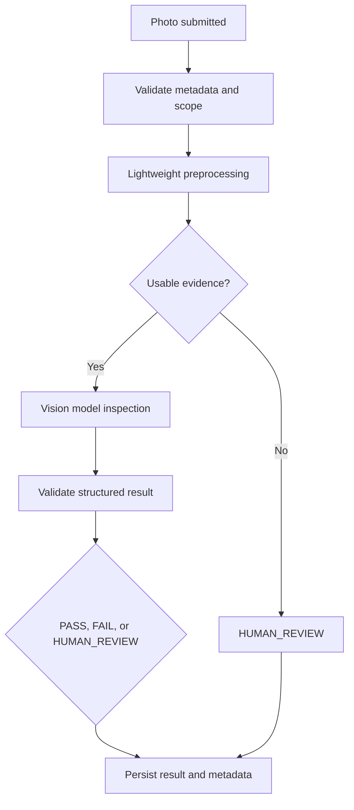

# Vision Pipeline

## Purpose

This document defines the AI vision pipeline for DOYA OS v1.0.

It covers evidence intake, preprocessing, model routing, output validation, review routing, and audit metadata for visual inspection workflows.

## Problem

Vision AI can be expensive, slow, and unreliable when every image is sent directly to a large multimodal model.

Restaurant closing photos also vary in lighting, framing, angle, and quality. The pipeline must detect unusable input before inspection and route uncertainty to humans.

## Solution

Use a staged vision pipeline:

1. Validate metadata and permissions.
2. Run lightweight preprocessing.
3. Route only valid evidence to a vision model.
4. Validate structured output.
5. Return `PASS`, `FAIL`, or `HUMAN_REVIEW`.
6. Persist source references, model metadata, prompt version, and review state.

## User

This document is for AI engineers, backend engineers, storage implementers, security reviewers, and AI coding agents.

## Inputs

- Uploaded image storage path.
- Closing category.
- Store ID.
- Organization ID.
- Business date.
- Submitting staff ID and role.
- Required evidence policy.
- Prior submission state.
- Prompt version and inspection policy version.

## Outputs

- Evidence validation status.
- Image quality score or reason.
- Vision model result: `PASS`, `FAIL`, or `HUMAN_REVIEW`.
- Confidence score.
- Human-readable reason.
- Source references.
- Model version.
- Prompt version.
- Review record when required.

## Model Strategy

Use a cascade:

- Deterministic metadata validation first.
- Lightweight image preprocessing for blur, darkness, resolution, file type, duplicate hash, and category mismatch signals.
- Vision model call only when the photo passes basic quality requirements.
- Optional second model or re-check only for high-impact or conflicting outputs.

Irreversible decisions must not depend on one model response.

## Prompt Strategy

Vision prompts must be category-specific and constrained.

Prompt requirements:

- Include the required category criteria.
- Require one of `PASS`, `FAIL`, or `HUMAN_REVIEW`.
- Require a short reason visible to managers.
- Require `HUMAN_REVIEW` for low-quality or ambiguous evidence.
- Forbid assumptions about staff intent.
- Forbid disciplinary language.

## Validation Strategy

Validate:

- Storage path belongs to the correct organization and store.
- Submission category matches required area.
- Image is accessible and not deleted.
- Output schema is valid.
- Confidence is within `0` and `1`.
- Result state is allowed.
- Failed result includes manager-readable reason.

## Failure Modes

- Missing file.
- Unsupported file type.
- Blurry or dark image.
- Duplicate image from another category or date.
- Storage access failure.
- Model timeout.
- Invalid structured output.
- Low confidence.
- Conflicting preprocessing and model result.

## Human Review Rules

Route to human review when:

- Evidence quality is poor.
- The model returns low confidence.
- Model output is malformed.
- The photo appears reused or mismatched.
- Category criteria are ambiguous.
- Staff or manager disputes the output.

## Cost Control Rules

- Reject invalid files before model calls.
- Use image hashes to avoid reprocessing duplicate submissions.
- Store validated preprocessing metadata.
- Batch only where latency does not hurt staff workflow.
- Apply stricter retry limits after repeated invalid uploads.

## Safety Rules

- Vision AI cannot mark a person as dishonest.
- Vision AI cannot apply final staff consequences.
- Vision AI cannot close a session while required reviews remain open.
- Vision AI must keep evidence and result visible to managers.

## Database/API Dependencies

- `closing_photo_submissions`
- `closing_sessions`
- `vision_reviews`
- `audit_logs`
- `POST /ai-closing/submissions`
- `GET /ai-closing/inspection-jobs/{jobId}`
- `POST /ai-closing/reviews/{id}/approve`
- `POST /ai-closing/reviews/{id}/reject`

## Flow

## Architecture

The Vision Pipeline is shared infrastructure for AI Closing. It may later support other inspection workflows, but v1.0 is scoped to kitchen and hall closing evidence.

## Future Extension

- Video frame sampling.
- Offline evidence queue.
- Equipment-specific model policies.
- Cross-store image quality monitoring.
- Evaluation dataset built from reviewed submissions.

## Related Documents

- [AI Principles](./01_AI_Principles.md)
- [AI Closing Evaluator](./03_AI_Closing_Evaluator.md)
- [AI Closing Engine](../04_Engines/02_AI_Closing_Engine.md)
- [AI Closing API](../06_API/07_AI_Closing_API.md)
