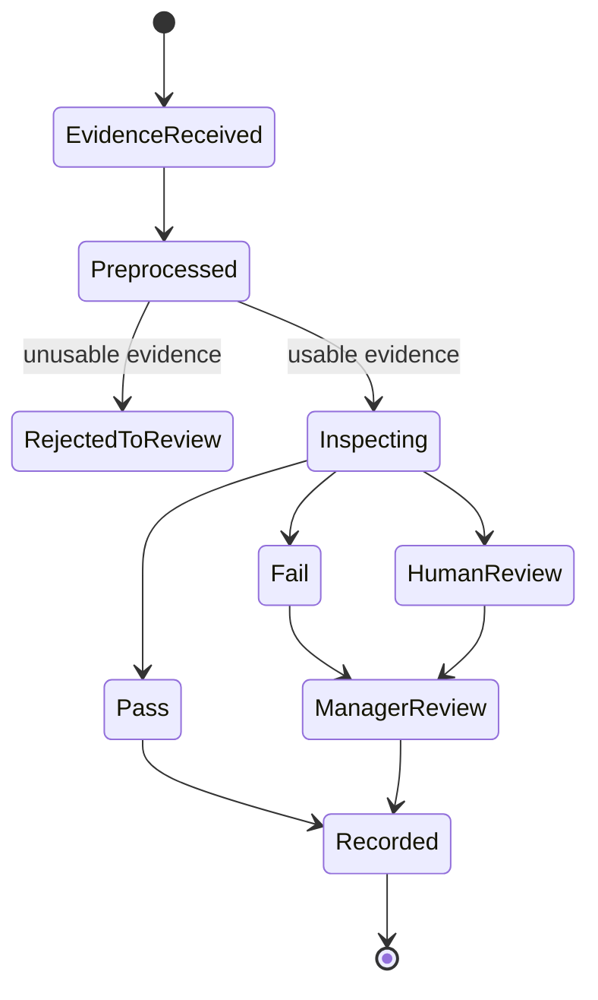

# AI Closing Evaluator

## Purpose

This document defines the AI Closing Evaluator for DOYA OS v1.0.

The evaluator inspects kitchen and hall closing evidence and returns `PASS`, `FAIL`, or `HUMAN_REVIEW`.

## Problem

Closing quality is difficult to verify remotely, but incorrect AI inspection can create unfair manager workload or staff correction.

The evaluator must be strict enough to catch operational problems and humble enough to defer when evidence is unclear.

## Solution

Use category-specific inspection policies supported by the Vision Pipeline.

The evaluator classifies the evidence, explains the reason, records confidence, and routes manager review when the output is uncertain or failed.

## User

This document affects Kitchen staff, Hall staff, Managers, Owners, AI engineers, and backend engineers.

## Inputs

- Closing area: `kitchen` or `hall`.
- Category: `floor_drain`, `refrigerator`, `stove_grease`, `tables_chairs`, `floor`, or `counter_pos`.
- Submitted photo reference.
- Business date.
- Store and organization scope.
- Required criteria for the category.
- Preprocessing output.
- Prior submission and review state.

## Outputs

- `PASS`, `FAIL`, or `HUMAN_REVIEW`.
- Confidence score.
- Failure or review reason.
- Evidence quality metadata.
- Source record references.
- Prompt and model version.
- Review requirement flag.

## Model Strategy

Use one primary vision model call after preprocessing. Use deterministic guardrails to force `HUMAN_REVIEW` for low-quality input.

For high-impact repeated failures or confidence near threshold, a second model pass or human review is preferred over automatic finalization.

## Prompt Strategy

Prompts must be category-specific.

Required prompt behavior:

- Inspect only the documented category.
- Do not infer conditions outside the visible evidence.
- Return only allowed result states.
- Explain the visible reason in operational language.
- Use `HUMAN_REVIEW` when the image does not show the required area clearly.

No prompt implementation is defined in this document.

## Validation Strategy

Validate:

- Category belongs to area.
- Evidence belongs to submission and store.
- Result is one of the allowed states.
- Reason is present for `FAIL` and `HUMAN_REVIEW`.
- Confidence is recorded.
- Manager review is created for failures and uncertain results according to policy.

## Failure Modes

- Photo does not show required area.
- Photo is too dark, blurry, cropped, or obstructed.
- Model returns unsupported result.
- Model misses residue or cleanliness issue.
- Model flags clean evidence incorrectly.
- Reused evidence creates false confidence.
- Inspection service times out.

## Human Review Rules

Manager review is required for:

- `FAIL` results unless policy allows auto-fail display with manager queue.
- All `HUMAN_REVIEW` results.
- Low confidence near threshold.
- Reused or suspicious evidence.
- Staff resubmission after rejection.

Owner review is read-oriented in v1.0 and only becomes decision-oriented when surfaced by AI Manager.

## Cost Control Rules

- Preprocess before model call.
- Avoid re-inspecting identical evidence.
- Reuse model output during polling.
- Do not generate verbose explanations for staff views.
- Limit retries after repeated invalid submissions.

## Safety Rules

- The evaluator inspects evidence, not employee intent.
- A failed inspection is not a disciplinary finding.
- Manager correction remains the human operating action.
- Staff see task status and required action, not hidden analytics.
- Result metadata must be auditable.

## Database/API Dependencies

- `closing_sessions`
- `closing_photo_submissions`
- `vision_reviews`
- `audit_logs`
- `POST /ai-closing/submissions`
- `GET /ai-closing/submissions/{id}`
- `GET /ai-closing/inspection-jobs/{jobId}`
- `POST /ai-closing/reviews/{id}/assign-correction`

## Flow

## Architecture

The AI Closing Evaluator is a model-backed component inside the AI Closing workflow. It does not own closing session state; it produces inspection outputs consumed by the AI Closing Engine.

## Future Extension

- Category-specific thresholds by store.
- Video evidence.
- Training dataset from manager-reviewed failures.
- Recurring issue pattern detection.

## Related Documents

- [Vision Pipeline](./02_Vision_Pipeline.md)
- [Human Review](./08_Human_Review.md)
- [AI Closing Model](../05_Database/05_AI_Closing_Model.md)
- [AI Closing API](../06_API/07_AI_Closing_API.md)
