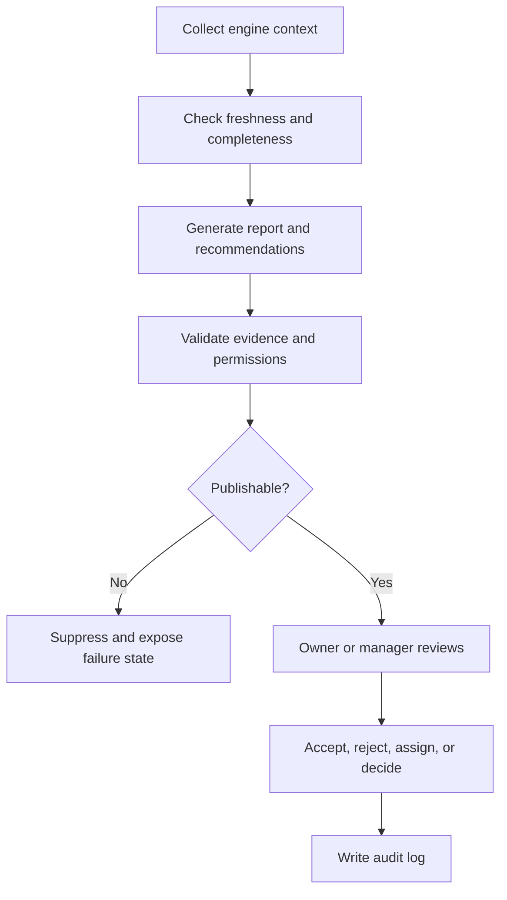

# AI Manager

## Purpose

This document defines the AI Manager module for DOYA OS v1.0.

AI Manager produces daily reports, alerts, recommendations, and evidence bundles for owner and manager review.

## Problem

AI summaries are dangerous when they hide source records or imply authority the system does not have.

AI Manager must explain operating state, not become a chatbot, autonomous operator, or generic dashboard narrative.

## Solution

AI Manager synthesizes store context from engines and produces reviewable outputs.

It may recommend actions, but humans accept, reject, assign, or decide.

## User

Primary users are Owner and Manager. Kitchen and Hall do not access AI Manager in v1.0.

## Inputs

- Vision snapshot.
- AI Closing outcomes.
- Inventory risk and reorder alerts.
- Bonus blockers and unlock state.
- SOP completion state.
- Notifications and unresolved review queues.
- Rule Engine decisions.
- Store, organization, role, and business-date context.
- Prompt version and model version.

## Outputs

- Daily report.
- Alerts.
- Recommendations.
- Evidence bundle.
- Severity.
- Suggested owner or role.
- Review state.
- Source references.
- Audit metadata for human actions.

## Model Strategy

Use deterministic aggregation before language generation.

Model use:

- Lightweight summarization for report text after source context is assembled.
- Stronger model for owner-facing recommendations or cross-domain reasoning.
- No model-generated action is applied directly.
- Missing context suppresses or downgrades output instead of inventing facts.

## Prompt Strategy

Prompt requirements:

- Use only supplied source records.
- State uncertainty and missing context.
- Cite source record IDs or evidence bundle references.
- Separate observation, risk, recommendation, and required human action.
- Avoid blame language and unsupported causal claims.
- Avoid recommendations outside v1.0 scope.

## Validation Strategy

Validate:

- Every alert and recommendation has evidence.
- Recommended action is allowed for the target role.
- Output references only visible store data.
- Severity is consistent with rule and engine signals.
- Prompt and model versions are recorded.
- Report status follows async API lifecycle.

## Failure Modes

- Missing Vision snapshot.
- Stale engine output.
- Evidence reference not visible under RLS.
- Duplicate alert storm.
- Model generates unsupported recommendation.
- Model omits source references.
- Report generation exceeds cost or time limit.

## Human Review Rules

Owner or Manager review is required before:

- Assigning action from a recommendation.
- Accepting or rejecting recommendation.
- Recording owner decision.
- Resolving critical alert.

AI Manager cannot directly correct inventory, closing, bonus, settings, or staff records.

## Cost Control Rules

- Use cached engine summaries.
- Generate one daily report per store and business date unless explicitly refreshed.
- Rate limit regeneration.
- Suppress report generation when required context is missing.
- Keep staff-facing text out of AI Manager generation because staff do not access it.

## Safety Rules

- AI Manager must not produce disciplinary findings.
- AI Manager must not make payroll, accounting, POS, or supplier decisions.
- AI Manager must not reveal manager-only evidence to staff.
- AI Manager must not fabricate data freshness.
- AI Manager output must be auditable.

## Database/API Dependencies

- `vision_reviews`
- `inventory_predictions`
- `bonus_pool_snapshots`
- `personal_kpi_snapshots`
- `notifications`
- `audit_logs`
- `GET /ai-manager/daily-report`
- `POST /ai-manager/daily-report/generate`
- `GET /ai-manager/jobs/{jobId}`
- `GET /ai-manager/evidence/{id}`

## Flow

## Architecture

AI Manager sits on top of Vision Engine, AI Closing, Inventory, Bonus, SOP, Rule, Notification, API, and Audit systems. It consumes source-of-truth outputs and creates reviewable synthesis.

## Future Extension

- Multi-store owner briefing.
- Conversational query over evidence.
- Trend explanations.
- AI quality dashboard.
- Recommendation simulation.

## Related Documents

- [AI Manager Engine](../04_Engines/05_AI_Manager_Engine.md)
- [AI Manager API](../06_API/06_AI_Manager_API.md)
- [Human Review](./08_Human_Review.md)
- [Prompt Design](./07_Prompt_Design.md)
