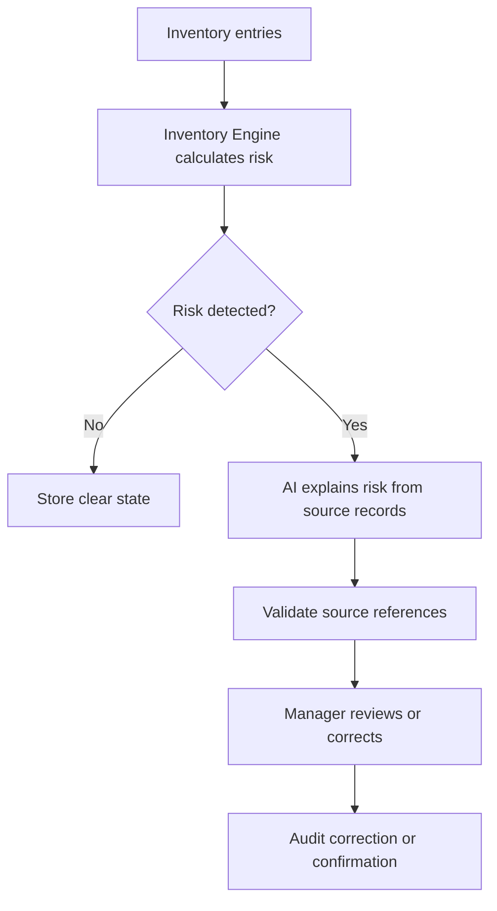

# Inventory Intelligence

## Purpose

This document defines AI-assisted Inventory Intelligence for DOYA OS v1.0.

It explains how AI may help summarize inventory risk while deterministic inventory calculations remain the source of truth.

## Problem

Inventory risk can be difficult for owners and managers to interpret when it is spread across daily weights, inbound stock, waste logs, and reorder predictions.

AI can help explain risk, but it must not invent consumption, replace manager confirmation, or turn v1.0 into accounting or supplier ordering.

## Solution

Use deterministic Inventory Engine outputs first. AI may summarize, classify, and explain risk after source records and calculations exist.

AI does not calculate payroll, accounting value, or supplier orders in v1.0.

## User

Primary users are Owner and Manager. Kitchen staff create inventory signals but do not see complex AI analytics.

## Inputs

- Inventory items.
- Daily weights.
- Inbound stock.
- Waste logs.
- Inventory predictions.
- Burn-rate calculations.
- Reorder alerts.
- Manager confirmations or corrections.
- Store, organization, role, and business-date context.

## Outputs

- Inventory risk explanation.
- Missing entry explanation.
- Waste variance explanation.
- Reorder alert summary.
- Source record references.
- Confidence or freshness status.
- Recommendation for manager review, not automatic correction.

## Model Strategy

Use deterministic inventory calculations as the baseline.

AI is used for:

- Explaining why a risk exists.
- Grouping related risk signals.
- Translating source records into owner or manager-readable language.
- Detecting likely data quality issues that need human review.

AI is not used to create source inventory quantities.

## Prompt Strategy

Prompt requirements:

- Use only supplied inventory records and predictions.
- Explain the source of risk with record references.
- State when baseline data is missing.
- Avoid ordering or purchasing instructions unless documented later.
- Separate deterministic facts from AI interpretation.

## Validation Strategy

Validate:

- Every AI inventory explanation references inventory source records.
- Quantities are copied from deterministic records, not generated.
- Unit labels match item configuration.
- Explanation is visible only to Owner or Manager.
- Staff-facing responses remain task and status oriented.

## Failure Modes

- Missing prior baseline.
- Duplicate or corrected inventory entry.
- Unit conversion not configured.
- Negative calculated consumption.
- Stale item configuration.
- AI explanation contradicts deterministic calculation.
- Source record hidden by RLS.

## Human Review Rules

Manager review is required when:

- AI flags data quality risk.
- Inventory prediction severity is warning or critical.
- AI explanation conflicts with deterministic output.
- Entry correction is needed.
- Owner-facing report includes unresolved inventory risk.

## Cost Control Rules

- Do not call AI for normal clear inventory state.
- Summarize only exceptions, warnings, and owner report inputs.
- Cache explanation per store, item, business date, and source version.
- Use deterministic thresholds before AI summarization.

## Safety Rules

- AI must not create or correct inventory quantities.
- AI must not produce accounting valuation.
- AI must not trigger supplier orders.
- AI must not hide missing or stale data.
- AI must not expose inventory records to Hall staff in v1.0.

## Database/API Dependencies

- `inventory_items`
- `inventory_inbound_batches`
- `inventory_daily_weights`
- `inventory_waste_logs`
- `inventory_predictions`
- `audit_logs`
- `GET /inventory/burn-rate`
- `GET /inventory/reorder-alerts`
- `POST /inventory/exceptions/{id}/confirm`
- `POST /inventory/exceptions/{id}/correct`

## Flow

## Architecture

Inventory Intelligence sits after deterministic inventory calculation. It converts risk into explainable review context for owners and managers.

## Future Extension

- Supplier recommendation explanation.
- Recipe-level consumption explanation.
- POS-linked variance once POS integration is in scope.
- Cross-store inventory anomaly summaries.

## Related Documents

- [Inventory Engine](../04_Engines/01_Inventory_Engine.md)
- [Inventory Model](../05_Database/06_Inventory_Model.md)
- [Inventory API](../06_API/08_Inventory_API.md)
- [AI Manager](./04_AI_Manager.md)
