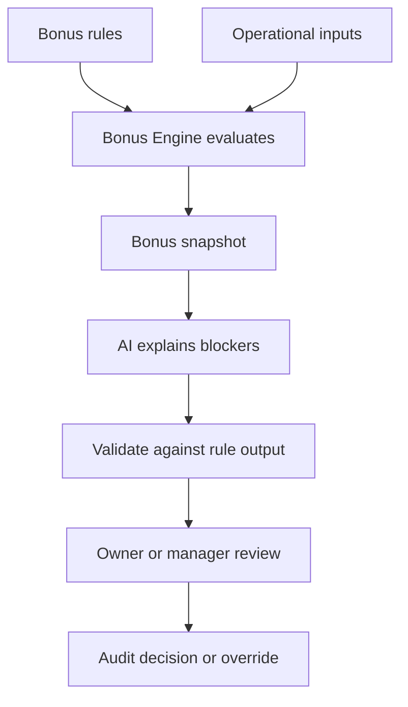

# Bonus Intelligence

## Purpose

This document defines AI-assisted Bonus Intelligence for DOYA OS v1.0.

It explains bonus blockers, store level progress, cooperation score signals, and unlock context without becoming payroll.

## Problem

Bonus state can create mistrust when staff and managers cannot understand what blocks unlock state.

AI can clarify blockers, but it must not calculate payroll, modify rules, decide payouts, or create hidden compensation logic.

## Solution

Use Bonus Engine snapshots and Rule Engine decisions as source truth.

AI may explain blockers and summarize rule outcomes for Owner and Manager. Staff see only approved store progress and their own visible share percentage when configured.

## User

Primary users are Owner and Manager. Kitchen and Hall receive limited staff-safe visibility through the Bonus API, not AI Manager analysis.

## Inputs

- Bonus periods.
- Active bonus rules and versions.
- Bonus pool snapshots.
- Personal KPI snapshots.
- SOP completion state.
- AI Closing results.
- Inventory risk state.
- Manager corrections.
- Owner overrides.

## Outputs

- Bonus blocker explanation.
- Store level progress explanation.
- Cooperation score explanation.
- Owner decision context.
- Staff-safe visibility status.
- Source references and rule version.

## Model Strategy

Use deterministic Bonus Engine evaluation for eligibility and numbers.

AI may:

- Explain blockers in plain operational language.
- Group related blockers by source workflow.
- Identify missing source data for manager review.
- Prepare owner-facing context for decisions.

AI must not calculate unlock status independently.

## Prompt Strategy

Prompt requirements:

- Reference active rule version and snapshot IDs.
- Separate rule outcome from AI explanation.
- Use neutral language.
- Avoid compensation amount, payroll, or payout claims.
- Do not expose other staff personal KPI details.

## Validation Strategy

Validate:

- Explanation matches snapshot unlock status.
- Rule version is included.
- Staff-visible output excludes other staff data.
- Owner override recommendations include human decision requirement.
- Payroll terms or payout amounts are absent.

## Failure Modes

- Missing active bonus rule.
- Conflicting rule versions.
- Late correction after period close.
- Missing source records.
- AI explanation contradicts rule evaluation.
- Personal share visibility not configured.
- Owner override reason missing.

## Human Review Rules

Human review is required for:

- Bonus status override.
- Rule confirmation.
- Blocker resolution.
- Personal share visibility changes.
- Any AI explanation that affects owner decision context.

## Cost Control Rules

- Do not call AI for staff share display.
- Generate explanations only for blockers, owner reports, or manager review.
- Cache explanation by bonus period, snapshot, and rule version.
- Reuse AI Manager context where possible.

## Safety Rules

- AI must not calculate payroll.
- AI must not promise payout.
- AI must not expose another staff member's share or KPI snapshot.
- AI must not override bonus rules.
- AI must cite source records and rule version.

## Database/API Dependencies

- `bonus_periods`
- `bonus_rules`
- `bonus_pool_snapshots`
- `personal_kpi_snapshots`
- `audit_logs`
- `GET /bonus/status`
- `GET /bonus/rules`
- `GET /bonus/my-share`
- `GET /bonus/blockers`
- `POST /bonus/status/{id}/override`

## Flow

## Architecture

Bonus Intelligence is an explanation layer over deterministic bonus snapshots. It supports trust and review without expanding v1.0 into payroll.

## Future Extension

- Rule simulation explanation.
- Multi-period bonus trend explanation.
- Payout approval context if payroll export becomes documented scope.
- Cross-store bonus blocker comparison.

## Related Documents

- [Bonus Engine](../04_Engines/04_Bonus_Engine.md)
- [Bonus Model](../05_Database/07_Bonus_Model.md)
- [Bonus API](../06_API/09_Bonus_API.md)
- [AI Manager](./04_AI_Manager.md)
