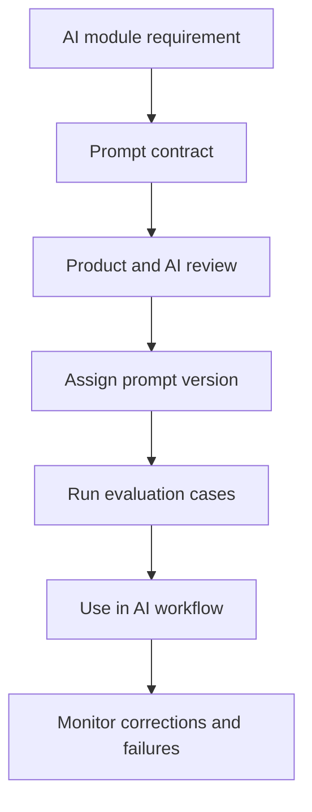

# Prompt Design

## Purpose

This document defines prompt architecture rules for DOYA OS v1.0.

It describes how prompts should be designed, versioned, validated, and reviewed without implementing prompt text yet.

## Problem

Prompt behavior can become undocumented product logic if prompts are written before architecture.

That creates drift: AI may recommend excluded features, ignore human review, expose hidden context, or produce output that cannot be tested.

## Solution

Treat prompts as versioned product contracts.

Prompt implementation belongs in `docs/09_Prompts/` or future implementation files. This document defines design rules only.

## User

This document is for AI engineers, prompt authors, backend engineers, product managers, reviewers, and AI coding agents.

## Inputs

- Product philosophy.
- Role and permission context.
- Store and business date.
- Source records.
- Allowed output schema.
- Safety policy.
- Human review policy.
- Prompt version metadata.

## Outputs

- Prompt contract requirements.
- Prompt version expectations.
- Required output constraints.
- Validation hooks.
- Evaluation criteria.

## Model Strategy

Prompt design must support model routing:

- Small models should handle constrained classification and low-risk summarization where adequate.
- Stronger models should handle ambiguous, cross-domain, or owner-facing synthesis.
- Vision models require category-specific inspection prompts.
- All prompts must be portable enough to support provider replacement.

## Prompt Strategy

Every prompt contract should define:

- Purpose.
- Input fields.
- Allowed output schema.
- Role and scope assumptions.
- Forbidden claims and actions.
- Required citations or source references.
- Human review triggers.
- Version identifier.
- Evaluation cases.

Prompts must not contain secrets, tenant-specific credentials, or undocumented business rules.

## Validation Strategy

Validate prompt output through:

- JSON schema or structured output checks.
- Allowed enum checks.
- Source reference checks.
- Role visibility checks.
- Safety phrase and forbidden-domain checks.
- Regression tests against evaluation cases.

## Failure Modes

- Prompt produces unsupported output.
- Prompt omits uncertainty.
- Prompt recommends excluded v1.0 behavior.
- Prompt leaks hidden source data.
- Prompt overstates confidence.
- Prompt invents operational facts.
- Prompt version is not recorded.

## Human Review Rules

Prompt changes require review when they affect:

- Closing pass or fail behavior.
- AI Manager recommendation behavior.
- Bonus blocker explanation.
- Owner decision context.
- Staff-facing status language.

Review should include product, AI, and engineering owners.

## Cost Control Rules

- Keep prompts minimal and structured.
- Avoid sending full history when source summaries are sufficient.
- Use retrieved source records, not broad context dumps.
- Reuse shared prompt fragments only when they preserve module-specific rules.
- Track token and image costs by prompt version.

## Safety Rules

- Prompts must instruct the model to defer when evidence is incomplete.
- Prompts must not authorize direct operational mutation.
- Prompts must not ask for hidden reasoning.
- Prompts must not produce payroll, disciplinary, legal, or supplier decisions.
- Prompts must preserve role visibility.

## Database/API Dependencies

- Prompt version metadata in AI output records.
- `closing_photo_submissions.prompt_version`
- Future prompt registry records.
- `GET /ai-manager/jobs/{jobId}`
- `GET /ai-closing/inspection-jobs/{jobId}`
- `GET /audit-logs/source/{sourceTable}/{sourceId}`

## Flow

## Architecture

Prompt design is part of the AI control plane. It connects product rules, model routing, evaluation, and auditability.

## Future Extension

- Prompt registry.
- Prompt version lifecycle.
- Prompt evaluation dashboard.
- Tenant-specific prompt policy overlays.

## Related Documents

- [AI Principles](./01_AI_Principles.md)
- [Evaluation and Testing](./11_Evaluation_And_Testing.md)
- [AI Manager](./04_AI_Manager.md)
- [AI Closing Evaluator](./03_AI_Closing_Evaluator.md)
