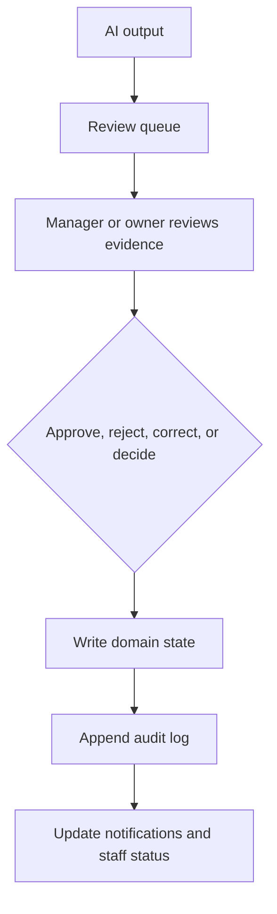

# Human Review

## Purpose

This document defines human review rules for AI workflows in DOYA OS v1.0.

It explains when managers or owners must approve, reject, correct, or record decisions after AI assistance.

## Problem

AI systems become unsafe when they silently finalize operational outcomes.

In DOYA OS, AI results can affect closing quality, manager corrections, inventory exceptions, bonus blockers, and owner decisions. Human review keeps the system accountable.

## Solution

Human review is a first-class workflow state.

AI can inspect, summarize, and recommend. Managers correct. Owners decide. The system records review outcomes and audit logs.

## User

Primary users are Manager and Owner. Kitchen and Hall participate through resubmission and task completion, not review authority.

## Inputs

- AI inspection result.
- AI Manager recommendation.
- Inventory exception.
- Bonus blocker.
- Evidence bundle.
- Source record references.
- Actor role and permission.
- Current workflow state.

## Outputs

- Approved result.
- Rejected result.
- Correction assignment.
- Owner decision record.
- Review notes.
- Audit log.
- Notification updates.

## Model Strategy

Human review does not require a model call.

AI may prepare evidence summaries for reviewers, but the review action is a human-authored state transition.

## Prompt Strategy

Review-support prompts must:

- Summarize evidence, not decide.
- Show uncertainty.
- Preserve source references.
- Avoid persuasive pressure.
- Make the required human action clear.

## Validation Strategy

Validate:

- Actor has permission for review action.
- Review state is open.
- Source record is visible and current.
- Rejection and override include reason.
- Corrective action has assignee and instructions.
- Audit log will be written.

## Failure Modes

- Review conflict from simultaneous manager actions.
- Stale AI result after resubmission.
- Missing evidence.
- Actor lacks role permission.
- Owner override without reason.
- Review attempts after session is closed.

## Human Review Rules

Manager reviews:

- Failed or uncertain closing inspections.
- Inventory exceptions and corrections.
- SOP task rejections.
- Operational notifications requiring correction.

Owner reviews:

- Final decision-required AI Manager recommendations.
- Bonus overrides.
- Organization-level risk.
- Cross-store decisions in future versions.

## Cost Control Rules

- Do not call models during simple approve or reject actions.
- Reuse existing evidence summaries.
- Generate fresh AI summaries only when source records changed.
- Prefer deterministic review queues over AI-generated queue ordering until evidence proves value.

## Safety Rules

- Human review actions must be auditable.
- AI cannot approve its own result.
- Overrides require reason.
- Staff-facing status must not expose hidden manager notes.
- Human review must preserve correction path for staff.

## Database/API Dependencies

- `vision_reviews`
- `audit_logs`
- `notifications`
- `closing_photo_submissions`
- `inventory_predictions`
- `bonus_pool_snapshots`
- `POST /ai-closing/reviews/{id}/approve`
- `POST /ai-closing/reviews/{id}/reject`
- `POST /ai-manager/recommendations/{id}/accept`
- `POST /ai-manager/recommendations/{id}/reject`
- `POST /bonus/status/{id}/override`

## Flow

## Architecture

Human Review connects AI outputs to operational authority. It is the control point that prevents AI from becoming an autonomous restaurant operator.

## Future Extension

- Multi-review approval for high-impact decisions.
- Review quality metrics.
- Reviewer calibration tools.
- Owner escalation workflow.

## Related Documents

- [AI Principles](./01_AI_Principles.md)
- [AI Closing Evaluator](./03_AI_Closing_Evaluator.md)
- [AI Manager](./04_AI_Manager.md)
- [Audit Log API](../06_API/13_Audit_Log_API.md)
