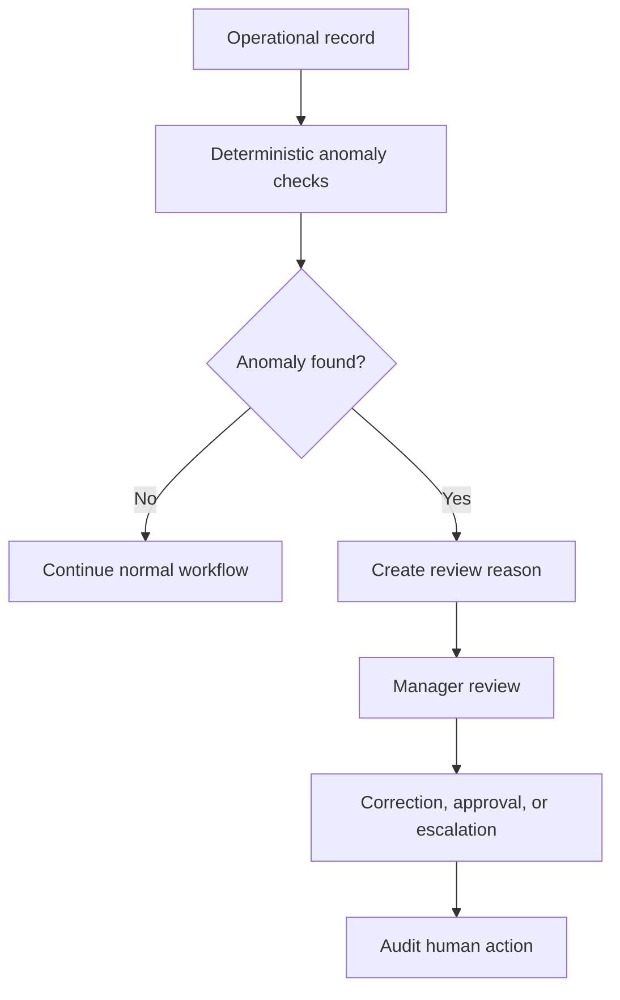

# Fraud Detection

## Purpose

This document defines AI-assisted fraud and anomaly detection for DOYA OS v1.0.

It focuses on evidence integrity and operational anomalies without making accusations or disciplinary decisions.

## Problem

Restaurant operating systems can be affected by reused photos, mismatched evidence, suspicious timing, duplicate entries, and inconsistent inventory records.

AI can help detect patterns, but it must not label staff as fraudulent. It should route suspicious signals to manager review with evidence.

## Solution

Use fraud detection as an anomaly and evidence-integrity module.

The module flags suspicious records, explains the signal, links evidence, and routes review. Human managers decide what correction is needed.

## User

Primary users are Manager and Owner. Staff may be asked to resubmit or correct records but do not see fraud analytics in v1.0.

## Inputs

- Closing photo metadata.
- Image hash and quality metadata.
- Submission timestamps.
- Business date and closing category.
- Inventory entries.
- Corrections and resubmissions.
- Staff role and store assignment.
- Prior anomaly history within store scope.

## Outputs

- Anomaly flag.
- Evidence integrity warning.
- Review reason.
- Source references.
- Severity.
- Human review route.
- Audit metadata for manager action.

## Model Strategy

Use deterministic and lightweight checks first:

- Duplicate image hash.
- Reused storage path.
- Timestamp outside expected window.
- Category mismatch.
- Repeated correction pattern.
- Inventory quantity outlier.

Use AI only to explain or classify ambiguous visual evidence. Do not use AI to infer intent.

## Prompt Strategy

Prompt requirements:

- Describe evidence anomaly, not staff intent.
- Use neutral terms such as "requires review" or "evidence mismatch."
- Require source references.
- Avoid words that imply guilt.
- Route ambiguous evidence to `HUMAN_REVIEW`.

## Validation Strategy

Validate:

- Anomaly signal has source records.
- Actor can view source records.
- Severity is bounded.
- Staff-facing message is correction-oriented.
- Manager-facing message includes review reason and evidence.

## Failure Modes

- False positive duplicate from legitimate retake.
- Similar-looking restaurant areas.
- Device clock mismatch.
- Offline upload delay.
- Missing image hash.
- AI overstates anomaly significance.
- Outlier caused by valid operational event.

## Human Review Rules

Manager review is required for:

- Duplicate evidence warnings.
- Suspicious category mismatch.
- Repeated closing resubmission anomaly.
- Inventory anomaly that affects bonus or owner report.

Owner review may be required when anomaly patterns affect bonus override or store-level risk.

## Cost Control Rules

- Prefer deterministic anomaly checks.
- Use image hashing and metadata before model calls.
- Do not run AI on every normal submission.
- Batch anomaly summaries for AI Manager instead of generating per-record narrative unless needed.

## Safety Rules

- The system must not accuse staff of fraud.
- Fraud Detection must not trigger disciplinary action.
- Findings must be reviewable and correctable.
- Staff-facing copy must request correction or resubmission.
- Audit logs must record human review actions, not AI suspicion alone.

## Database/API Dependencies

- `closing_photo_submissions`
- `vision_reviews`
- `inventory_daily_weights`
- `inventory_waste_logs`
- `inventory_predictions`
- `notifications`
- `audit_logs`
- `GET /ai-closing/submissions/{id}`
- `POST /ai-closing/reviews/{id}/assign-correction`
- `GET /audit-logs/source/{sourceTable}/{sourceId}`

## Flow

## Architecture

Fraud Detection is a review-routing module, not an enforcement module. It protects evidence quality and operational trust while preserving human judgment.

## Future Extension

- Cross-store anomaly baselines.
- Device trust signals.
- Offline upload integrity metadata.
- Review calibration for false positives.

## Related Documents

- [AI Principles](./01_AI_Principles.md)
- [Vision Pipeline](./02_Vision_Pipeline.md)
- [Human Review](./08_Human_Review.md)
- [Audit Log Model](../05_Database/10_Audit_Log_Model.md)
