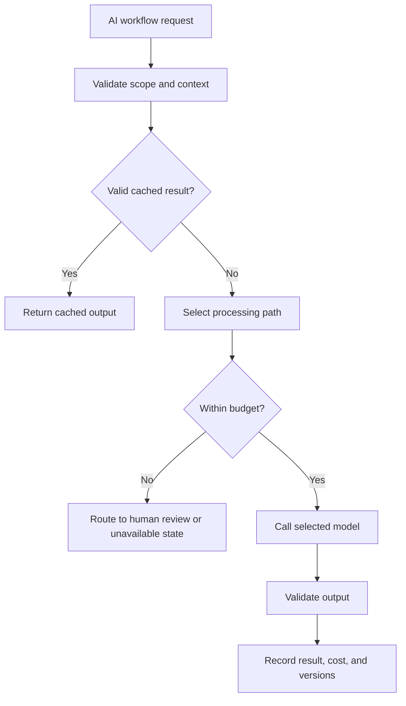

# Model Routing and Cost Control

## Purpose

This document defines model routing and cost control for DOYA OS v1.0.

It ensures AI calls are deliberate, explainable, scoped, and economically sustainable.

## Problem

Sending every image, record, and summary to the most capable model is expensive and increases latency.

Restaurant staff need fast workflows. Owners and managers need reliable summaries. The system must choose model depth based on risk, ambiguity, and business value.

## Solution

Use a routing cascade:

1. Deterministic validation.
2. Lightweight preprocessing.
3. Low-cost model where appropriate.
4. Stronger model only for ambiguous, high-impact, or owner-facing synthesis.
5. Human review for uncertain or irreversible cases.

## User

This document is for AI engineers, backend engineers, platform engineers, product managers, and AI coding agents.

## Inputs

- Workflow type.
- Evidence type.
- Risk level.
- Required latency.
- Role and business-date context.
- Cached source summaries.
- Prior model result.
- Cost budget policy.
- Human review availability.

## Outputs

- Selected processing path.
- Selected model class.
- Skipped model call reason.
- Cost metadata.
- Latency metadata.
- Fallback state.
- Human review route when needed.

## Model Strategy

Routing policy:

| Work type | Default path |
| --- | --- |
| Scope and schema validation | Deterministic only. |
| Image quality checks | Lightweight preprocessing. |
| Closing inspection | Vision model after preprocessing. |
| Inventory clear state | Deterministic only. |
| Inventory exception explanation | Text model when owner or manager context needs it. |
| Bonus status | Deterministic snapshot first; AI explanation only for blockers. |
| AI Manager report | Text model after context assembly and freshness checks. |

## Prompt Strategy

Prompt routing should match model routing:

- Small prompts for constrained classification.
- Category-specific prompts for vision inspection.
- Evidence-bundle prompts for AI Manager synthesis.
- No broad repository or database dumps.
- No prompt implementation in this document.

## Validation Strategy

Validate:

- Model call is allowed for workflow and role.
- Required context is complete.
- Cost budget is available.
- Cached output is not stale.
- Fallback exists when model call fails.
- Output passes module validation before publication.

## Failure Modes

- Cost budget exceeded.
- Model provider timeout.
- Model provider unavailable.
- Routing sends high-impact case to insufficient model.
- Cache returns stale output.
- Repeated retries create cost spike.
- Fallback suppresses needed manager review.

## Human Review Rules

Human review is the fallback for:

- Model unavailability.
- Cost budget exhaustion on high-impact workflow.
- Ambiguous result near threshold.
- Conflicting model and deterministic signals.
- Any workflow where no safe automated fallback exists.

## Cost Control Rules

- Record cost metadata by module, model, store, and business date.
- Deduplicate repeated requests by idempotency key and source hash.
- Cache AI Manager reports per store and business date.
- Cache vision results by submission and evidence hash.
- Apply rate limits to regeneration endpoints.
- Prefer review queue over repeated model retries.

## Safety Rules

- Cost control must not silently mark risky records as passed.
- Budget exhaustion should route review or expose unavailable state.
- Stronger model output still requires validation.
- Service-role model calls must preserve source actor and audit metadata.

## Database/API Dependencies

- AI job records when implemented.
- Prompt and model version metadata.
- `closing_photo_submissions`
- `inventory_predictions`
- `bonus_pool_snapshots`
- `audit_logs`
- `GET /ai-manager/jobs/{jobId}`
- `GET /ai-closing/inspection-jobs/{jobId}`

## Flow

## Architecture

Model routing is platform infrastructure used by AI Closing, AI Manager, Inventory Intelligence, Bonus Intelligence, and Fraud Detection.

## Future Extension

- Provider failover.
- Tenant-specific cost budgets.
- Model performance dashboard.
- Automatic route tuning from evaluation outcomes.

## Related Documents

- [AI Principles](./01_AI_Principles.md)
- [Vision Pipeline](./02_Vision_Pipeline.md)
- [AI Manager](./04_AI_Manager.md)
- [Evaluation and Testing](./11_Evaluation_And_Testing.md)
