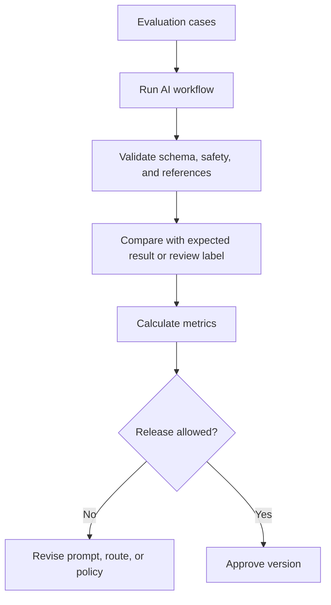

# Evaluation and Testing

## Purpose

This document defines evaluation and testing for DOYA OS AI workflows.

It describes how AI behavior should be measured before and after implementation.

## Problem

AI quality cannot be trusted from manual spot checks.

Closing inspection, AI Manager recommendations, inventory explanations, and bonus blocker summaries need regression tests, review metrics, and failure tracking.

## Solution

Use layered evaluation:

- Static contract tests for output shape.
- Dataset evaluation for known examples.
- Human review comparison for inspection quality.
- Production monitoring for correction rate and stale context.
- Regression tests before prompt or model changes.

## User

This document is for AI engineers, QA engineers, backend engineers, product managers, reviewers, and AI coding agents.

## Inputs

- Labeled closing evidence.
- Manager review outcomes.
- Inventory exception cases.
- Bonus blocker snapshots.
- AI Manager report examples.
- Prompt versions.
- Model versions.
- Error and audit records.

## Outputs

- Evaluation results.
- Regression pass or fail status.
- Accuracy and review routing metrics.
- False pass and false fail analysis.
- Cost and latency metrics.
- Prompt or model release recommendation.

## Model Strategy

Evaluation must compare model routes, not just single model quality.

Metrics should include:

- Vision pass accuracy.
- Vision fail detection.
- Human review routing rate.
- False pass rate.
- False fail rate.
- Invalid output rate.
- Cost per accepted output.
- Review correction rate.

## Prompt Strategy

Prompt changes require evaluation cases:

- Expected structured output.
- Required source references.
- Required human review behavior.
- Forbidden recommendations.
- Role visibility checks.
- Safety checks for excluded domains.

## Validation Strategy

Validate every AI module against:

- Schema.
- Source references.
- Permission boundary.
- Human review trigger.
- Audit metadata.
- Cost metadata.
- Regression dataset.

## Failure Modes

- Evaluation dataset does not represent real restaurant conditions.
- Human labels are inconsistent.
- Prompt passes examples but fails production edge cases.
- Model version changes behavior unexpectedly.
- Metrics optimize for pass rate but miss false passes.
- Cost improves while quality drops.

## Human Review Rules

Human reviewers should:

- Label ambiguous cases explicitly.
- Record disagreement with AI result.
- Distinguish evidence quality issue from actual operational failure.
- Provide correction reason when rejecting.
- Feed reviewed outcomes into future evaluation sets.

## Cost Control Rules

- Run full evaluation before major prompt or model changes.
- Use smaller sampled evaluation for routine checks.
- Track cost per evaluation run.
- Avoid running expensive vision tests for unchanged prompts and models unless source pipeline changed.

## Safety Rules

- False passes are higher risk than false human-review routing.
- Evaluation must test tenant and role leakage.
- Evaluation must test unavailable or stale context.
- AI outputs that cannot be audited fail evaluation.
- Prompt or model changes cannot ship when they remove human review triggers.

## Database/API Dependencies

- `closing_photo_submissions`
- `vision_reviews`
- `audit_logs`
- Future evaluation datasets.
- `GET /ai-closing/inspection-jobs/{jobId}`
- `GET /ai-manager/jobs/{jobId}`
- `GET /audit-logs/source/{sourceTable}/{sourceId}`

## Flow

## Architecture

Evaluation is part of the AI release process. It connects prompt design, model routing, human review, audit logs, and production monitoring.

## Future Extension

- Evaluation dataset repository.
- Review calibration interface.
- Model comparison dashboard.
- Automated regression gates in CI after implementation exists.

## Related Documents

- [AI Principles](./01_AI_Principles.md)
- [Prompt Design](./07_Prompt_Design.md)
- [Human Review](./08_Human_Review.md)
- [Model Routing and Cost Control](./10_Model_Routing_And_Cost_Control.md)
