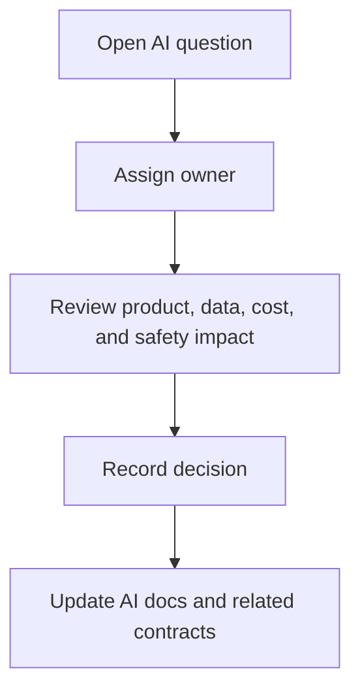

# AI Open Questions

## Purpose

This document records unresolved AI architecture questions for DOYA OS v1.0.

It keeps unknowns visible without turning them into implementation assumptions.

## Problem

AI implementation requires decisions about providers, thresholds, datasets, costs, review policy, storage, and prompt governance.

If these decisions are made inside code or prompts without documentation, AI behavior will drift from the product architecture.

## Solution

Track AI decisions here until they are resolved in source-of-truth documents or decision records.

## User

This document is for AI engineers, backend engineers, product managers, security reviewers, and AI coding agents.

## Inputs

- AI architecture documents.
- Engine contracts.
- Database constraints.
- API contracts.
- Human review outcomes.
- Product decisions.

## Outputs

- Explicit open questions.
- Recommended direction.
- Affected documents.
- Future decision record candidates.

## Model Strategy

No model strategy is selected here. Open questions must be resolved before provider-specific routing or model implementation is documented.

## Prompt Strategy

No prompt implementation is defined here. Prompt-related questions identify required decisions before `docs/09_Prompts/` is populated.

## Validation Strategy

An open question is ready to close when:

- The decision has an owner.
- The affected workflows are known.
- Documentation is updated.
- Any major tradeoff is recorded in `docs/decisions/`.

## Failure Modes

- Implementation assumes an answer not documented.
- Prompt behavior encodes a hidden product decision.
- Model routing depends on undocumented cost policy.
- Review thresholds are set without evaluation data.

## Human Review Rules

Questions affecting final review authority, correction workflow, bonus impact, or owner decisions require product and operations review before closure.

## Cost Control Rules

Questions affecting model routing, retries, caching, or evaluation volume require cost review before closure.

## Safety Rules

No unresolved question may be bypassed by creating irreversible AI behavior.

When uncertain, route to human review and record the missing decision.

## Database/API Dependencies

Open questions reference existing architecture:

- [Database Architecture](../05_Database/README.md)
- [API Architecture](../06_API/README.md)
- [Engine Architecture](../04_Engines/README.md)

## Flow

## Architecture

### Question 1: Where are AI job records stored?

Recommended direction:

- Add a shared async job model before implementation.
- Include job status, source record, requested actor, model version, prompt version, cost metadata, and failure reason.

Affected documents:

- [Model Routing and Cost Control](./10_Model_Routing_And_Cost_Control.md)
- [AI Manager API](../06_API/06_AI_Manager_API.md)
- [AI Closing API](../06_API/07_AI_Closing_API.md)

### Question 2: What are the v1.0 confidence thresholds?

Recommended direction:

- Start conservative.
- Route near-threshold cases to `HUMAN_REVIEW`.
- Tune only after reviewed evidence creates an evaluation dataset.

Affected documents:

- [AI Closing Evaluator](./03_AI_Closing_Evaluator.md)
- [Evaluation and Testing](./11_Evaluation_And_Testing.md)

### Question 3: How should image preprocessing metadata be stored?

Recommended direction:

- Store preprocessing metadata with the submission or a related inspection metadata record.
- Include hash, quality flags, dimensions, and preprocessing version.

Affected documents:

- [Vision Pipeline](./02_Vision_Pipeline.md)
- [AI Closing Model](../05_Database/05_AI_Closing_Model.md)

### Question 4: What prompt registry structure is needed?

Recommended direction:

- Define prompt registry in `docs/09_Prompts/` after AI architecture is accepted.
- Track prompt key, version, module, schema, release state, and evaluation status.

Affected documents:

- [Prompt Design](./07_Prompt_Design.md)

### Question 5: What is the first evaluation dataset?

Recommended direction:

- Start with manager-reviewed closing submissions.
- Include both clear passes, clear failures, ambiguous cases, and poor-quality evidence.

Affected documents:

- [Evaluation and Testing](./11_Evaluation_And_Testing.md)

### Question 6: What cost budget applies per store?

Recommended direction:

- Define initial soft budgets by module and store after expected operating volume is known.
- Treat budget exhaustion as review routing, not automatic pass.

Affected documents:

- [Model Routing and Cost Control](./10_Model_Routing_And_Cost_Control.md)

### Question 7: What AI output is visible to staff?

Recommended direction:

- Staff see task status, required action, and pass or fail status only.
- Managers and Owners see evidence, reasons, and AI summaries according to role scope.

Affected documents:

- [Human Review](./08_Human_Review.md)
- [UX MVP Scope](../03_UX/14_MVP_Scope.md)

## Future Extension

Resolved questions should move into the relevant architecture document. Major tradeoffs should become decision records.

## Related Documents

- [AI Architecture](./README.md)
- [Documentation Style Guide](../STYLE_GUIDE.md)
- [API Open Questions](../06_API/15_Open_Questions.md)
- [Database Open Questions](../05_Database/13_Open_Questions.md)
