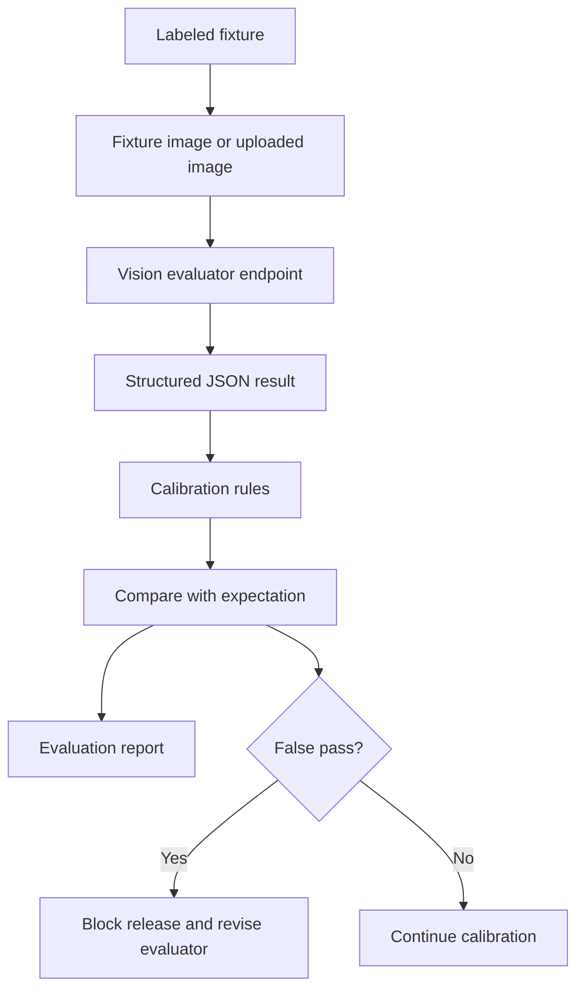

# AI Evaluation Lab

## Purpose

This document defines the AI Closing Evaluation Lab for DOYA OS.

The lab is a developer-only testing and calibration surface used to measure the Vision AI evaluator before it is trusted in restaurant operations. It gives AI engineers, QA engineers, product managers, and future contributors a repeatable way to compare model output against labeled closing evidence.

## Problem

Vision AI can appear correct during manual demos while still failing important restaurant edge cases.

For AI Closing, the riskiest failure is a false pass: a dirty or unsafe area is marked as clean and the store closes with unresolved operational risk. False fails are also harmful because they create unnecessary staff work, but they are safer than false passes because a manager can review and correct them.

Without an evaluation lab, prompt changes, model changes, and calibration changes would rely on spot checks instead of measurable evidence.

## Solution

DOYA OS uses a local developer evaluation lab at `/dev/ai-eval`.

The lab:

- Uses labeled fixture cases for kitchen and hall closing zones.
- Sends fixture images or uploaded images to the same Vision evaluator endpoint used by AI Closing.
- Compares the structured AI response against expected status, expected score range, and expected issue labels.
- Applies calibration rules before calculating the final decision.
- Tracks false pass, false fail, human review, pass, fail, and accuracy metrics.
- Keeps all fixture data local to the frontend implementation during v1 development.

The lab is not a staff feature and must not appear in normal product navigation.

## User

The lab is for:

- AI engineers calibrating prompts and model behavior.
- QA engineers validating regression cases.
- Frontend engineers testing result rendering.
- Product managers reviewing safety thresholds.
- Future contributors changing AI Closing evaluator behavior.

Restaurant staff, managers, and owners should not use this page during normal operations.

## Flow

The evaluation flow is:

1. Select a fixture.
2. Review the expected status, expected score range, expected issues, and notes.
3. Use the local fixture image placeholder or upload a replacement image.
4. Run the Vision evaluator.
5. Receive structured JSON from the evaluator.
6. Normalize the result through calibration rules.
7. Compare normalized output against the fixture expectation.
8. Record the outcome in the developer report.
9. Investigate false passes before any release.

## Architecture

The lab uses local frontend modules:

| Module | Responsibility |
| --- | --- |
| `frontend/lib/ai-closing/evaluation-fixtures.ts` | Fixture metadata, expected labels, expected score ranges, and notes. |
| `frontend/public/fixtures/ai-closing/` | Local placeholder images for developer calibration. |
| `frontend/lib/ai-closing/calibration.ts` | Thresholds, confidence floor, ambiguity handling, issue severity mapping, and report metrics. |
| `frontend/app/dev/ai-eval/page.tsx` | Developer-only route. |
| `frontend/components/dev/ai-eval-lab.tsx` | Interactive evaluation UI. |
| `frontend/app/api/ai-closing/evaluate/route.ts` | Existing Vision evaluator endpoint. |

The lab does not connect Supabase and does not create production backend storage.

### Fixture strategy

Initial fixtures cover the required AI Closing zones:

- `kitchen_floor_clean`
- `kitchen_floor_dirty`
- `refrigerator_clean`
- `refrigerator_dirty`
- `stove_clean`
- `stove_greasy`
- `hall_tables_aligned`
- `hall_tables_messy`
- `counter_clean`
- `counter_messy`

Each fixture must define:

- Image placeholder.
- Expected status.
- Expected score range.
- Expected detected issues.
- Notes explaining why the fixture matters.

Placeholder images are acceptable for developer wiring, but release calibration must replace them with real labeled restaurant evidence before operational use.

### False pass and false fail

| Outcome | Definition | Risk |
| --- | --- | --- |
| `CRITICAL_FALSE_PASS` | AI returns `PASS` when the fixture expects `FAIL`. | Highest risk. Dirty or unsafe evidence may be accepted. |
| `FALSE_FAIL` | AI returns `FAIL` when the fixture expects `PASS`. | Medium risk. Staff may be asked to re-clean unnecessarily. |
| `HUMAN_REVIEW` | AI output is ambiguous, low-confidence, or within the review range. | Acceptable when uncertainty is real. |

False pass is more dangerous than false fail because restaurant operations can close with unresolved risk.

### Calibration process

Calibration rules define:

- PASS threshold.
- FAIL threshold.
- HUMAN_REVIEW range.
- Confidence floor.
- Ambiguous result handling.
- Issue severity mapping.

If a model result falls below the confidence floor, the lab maps it to `HUMAN_REVIEW` before evaluating the final decision. This preserves the product rule that AI assists and humans decide when evidence is uncertain.

### Adding new test cases

To add a test case:

1. Add a labeled fixture entry in `frontend/lib/ai-closing/evaluation-fixtures.ts`.
2. Add a matching placeholder or real sample image under `frontend/public/fixtures/ai-closing/`.
3. Set `expected_status` to `PASS`, `FAIL`, or `HUMAN_REVIEW`.
4. Set `expected_score_range` based on the operating quality expected from the image.
5. Add `expected_detected_issues` for fail or review cases.
6. Add notes that explain why the case matters operationally.
7. Run `/dev/ai-eval`.
8. Investigate every `CRITICAL_FALSE_PASS` before changing prompts, thresholds, or model routing.

## Future Extension

Future versions should add:

- Real labeled image datasets from manager-reviewed submissions.
- CI-compatible evaluation runs for non-image contract tests.
- Model comparison mode.
- Prompt version comparison.
- Cost and latency reporting.
- Reviewer disagreement tracking.
- Exportable evaluation reports.

The first production gate should require zero critical false passes on the release fixture set.

## Related Documents

- [Evaluation and Testing](./11_Evaluation_And_Testing.md)
- [Vision Pipeline](./02_Vision_Pipeline.md)
- [AI Closing Evaluator](./03_AI_Closing_Evaluator.md)
- [Human Review](./08_Human_Review.md)
- [Model Routing and Cost Control](./10_Model_Routing_And_Cost_Control.md)
