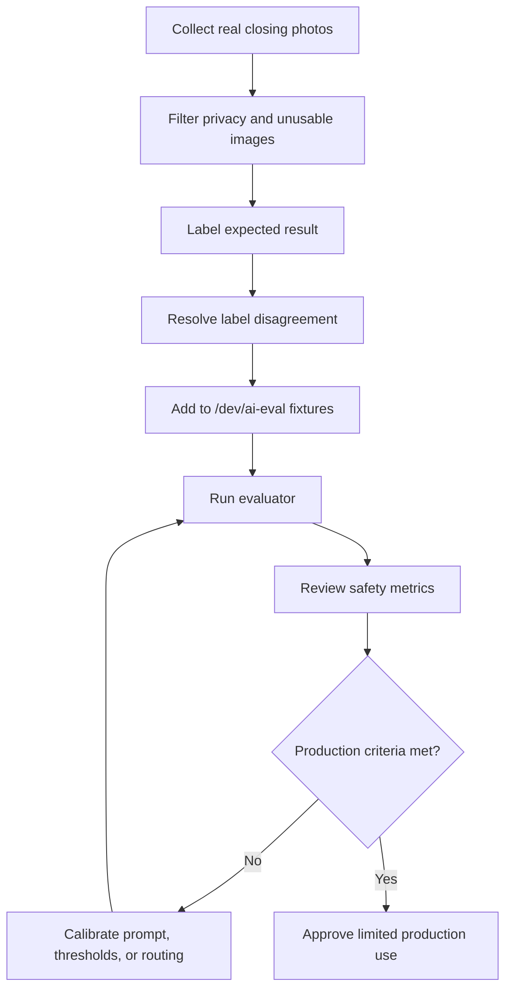

# Real-World AI Closing Testing Guide

## Purpose

This document defines how DOYA OS collects and labels real restaurant closing photos for AI Closing evaluation.

It explains how to build a reliable test set from real operations before the Vision AI evaluator is trusted in production. The guide exists so AI engineers, QA reviewers, product managers, and restaurant operators can collect evidence consistently and evaluate model readiness with measurable safety criteria.

## Problem

Placeholder fixtures and ad hoc screenshots are useful for wiring the Evaluation Lab, but they do not prove that AI Closing works in a restaurant.

Real closing photos vary by phone, lighting, staff position, camera angle, time of day, surface reflection, clutter, and cleaning style. If the test set is too small or biased, the evaluator may appear reliable while missing actual dirty conditions.

The highest-risk failure is a critical false pass: AI returns `PASS` for evidence that should fail. That can allow an unresolved closing issue to be recorded as complete.

## Solution

Collect real closing photos using a controlled but realistic process.

The collection process must:

- Cover every AI Closing zone.
- Include clean and dirty examples.
- Use multiple staff members and devices where possible.
- Vary lighting and angle without making the evidence unusable.
- Label each image with clear pass, fail, or human-review expectations.
- Add accepted examples to `/dev/ai-eval` fixtures before prompt or model calibration.
- Gate production readiness on false pass, false fail, and human review rates.

This guide does not define production photo storage. Real photos used for evaluation should be handled according to the restaurant's privacy and data retention policy before any persistent backend exists.

## User

This guide is for:

- AI engineers building evaluation datasets.
- QA engineers reviewing fixture quality.
- Product managers deciding production readiness.
- Restaurant managers supervising photo collection.
- Future contributors adding AI Closing test cases.

Kitchen and hall staff may help capture evidence, but they should not be responsible for final labels or model-readiness decisions.

## Flow

Use this flow for each real-world collection cycle:

1. Select a store, business date range, and zones to collect.
2. Brief staff on the required photo angles.
3. Capture normal closing photos during actual closing work.
4. Capture controlled dirty examples before the issue is corrected, when safe and allowed.
5. Remove unusable or privacy-sensitive images.
6. Label each image independently.
7. Resolve label disagreements with a manager or operations owner.
8. Add approved examples to the Evaluation Lab fixture set.
9. Run `/dev/ai-eval`.
10. Review false pass, false fail, and human review metrics.
11. Calibrate prompt, thresholds, or model routing.
12. Re-run the evaluation set before production release.



## Architecture

Real-world testing connects the restaurant operation, local fixture library, Vision evaluator, calibration rules, and release decision.

| Area | Responsibility |
| --- | --- |
| Restaurant operation | Provides realistic closing evidence from actual kitchen and hall workflows. |
| Manager review | Confirms whether evidence should pass, fail, or require review. |
| Fixture library | Stores labeled examples for repeatable evaluation. |
| Evaluation Lab | Runs model output against expected results. |
| Calibration rules | Converts raw model output into release-relevant decisions. |
| Release decision | Blocks production use when safety criteria are not met. |

The Evaluation Lab remains developer-only. It should not appear in staff navigation or replace manager review.

## Photo Collection

### General rules

Collect photos during real closing conditions whenever possible.

Rules:

- Use the same phones staff are likely to use in production.
- Capture the full required zone, not only the cleanest part.
- Avoid zoom unless the zone requires close inspection.
- Keep the camera stable enough for the area to be readable.
- Do not include staff faces, customers, payment screens, receipts, or private data.
- Do not stage unrealistic photos only to improve model scores.
- Keep original images when allowed so future evaluation can test model changes against the same evidence.

### Required photo angles by zone

| Zone | Required angles | What must be visible |
| --- | --- | --- |
| Kitchen Floor / Drain | One wide photo from the kitchen entry or main prep walkway. One closer photo of the drain when collecting extended datasets. | Floor surface, drain cover, surrounding tile, water path, debris-prone edges. |
| Refrigerator | One straight-on open-door photo. One lower-shelf photo when shelves are deep or lighting is weak. | Shelves, containers, labels, spills, bottom shelf, door gasket area when visible. |
| Stove Grease | One angled photo across the stove edge. One close photo of grease collection points for dirty examples. | Stove edge, backsplash-facing surface, grease collection points, visible residue. |
| Hall Tables / Chairs | One wide photo from the customer walkway. One side angle when alignment is hard to judge. | Table tops, chair positions, under-table floor, aisle clearance. |
| Hall Floor | One wide photo of the main walkway. One low-angle photo for streaks or debris when collecting dirty examples. | Main walking path, table edges, visible debris, wet streaks, high-traffic area. |
| Counter / POS | One straight-on counter photo. One angled photo showing the POS and pickup surface. | Counter surface, POS area, receipt printer area, customer pickup surface, clutter. |

### Clean and dirty examples

Each zone needs both positive and negative examples.

Minimum starting dataset per zone:

| Example type | Minimum count per zone | Notes |
| --- | ---: | --- |
| Clean `PASS` examples | 50 | Should include different staff, times, devices, and normal lighting variation. |
| Dirty `FAIL` examples | 50 | Should include realistic correctable issues, not extreme artificial mess only. |
| Ambiguous `HUMAN_REVIEW` examples | 20 | Include blur, low light, cropped zone, obstructed evidence, or uncertain cleanliness. |

Minimum first release dataset across six zones:

- 300 clean examples.
- 300 dirty examples.
- 120 ambiguous examples.
- At least 720 total labeled real-world images.

More examples are required before multi-store rollout because each store has different layout, lighting, materials, and cleaning patterns.

## Labeling Rules

### Status labels

Use these labels:

| Label | Meaning |
| --- | --- |
| `PASS` | Required zone is visible and appears acceptable for closing. |
| `FAIL` | Required zone is visible and contains a clear correctable issue. |
| `HUMAN_REVIEW` | Evidence is unclear, incomplete, low-quality, or operationally ambiguous. |

### Pass rules

Label an image `PASS` only when:

- The required zone is visible.
- Cleanliness can be judged from the image.
- No visible issue requires staff correction.
- The photo is good enough that a manager would not need another image.

### Fail rules

Label an image `FAIL` when:

- The required zone is visible.
- The issue is clear enough for staff to correct.
- The issue matters for closing readiness, cleanliness, food safety, or opening preparation.

Examples:

- Debris near a drain.
- Grease on stove edges.
- Spill or residue inside a refrigerator.
- Hall floor streaks or visible debris.
- Counter clutter after close.
- Tables or chairs not reset.

### Human review rules

Label an image `HUMAN_REVIEW` when:

- The required zone is cropped or missing.
- The image is too dark, blurry, reflective, or obstructed.
- A dirty condition may exist but cannot be confirmed.
- The zone is visible but the labeler cannot decide confidently.
- The image includes a privacy concern and should be excluded from automated evaluation.

`HUMAN_REVIEW` is not a failure of the product when uncertainty is real. It is a safety route.

### Label review process

Use at least two human labelers for each candidate image.

Rules:

- If both labelers agree, accept the label.
- If labelers disagree, route to a manager or operations owner.
- If disagreement remains after review, label `HUMAN_REVIEW` or exclude the image.
- Keep label notes for dirty and ambiguous examples.

## Bias Control

### Avoid lighting bias

Lighting bias appears when the dataset only contains bright, ideal photos or only dark, difficult photos.

Collection rules:

- Include normal daytime and nighttime lighting.
- Include photos with overhead lights, refrigerator light, and hall ambient light.
- Include mild shadows and reflections.
- Exclude images that are so dark the zone cannot be judged.
- Do not make all dirty examples darker than clean examples.
- Do not make all clean examples brighter than dirty examples.

The model should learn cleanliness, not brightness.

### Avoid repeated angle bias

Repeated angle bias appears when every example is taken from the same position.

Collection rules:

- Capture each zone from at least three common staff positions.
- Rotate between wide and close evidence where the zone requires it.
- Use different staff heights and hand positions where possible.
- Avoid duplicate photos from the same burst.
- Do not use the same clean photo as the basis for multiple fixture labels.
- Ensure dirty examples are not always close-up while clean examples are always wide.

The model should learn the zone condition, not a single memorized composition.

## File Naming

Use deterministic filenames so fixtures can be reviewed without opening every image.

Pattern:

```text
{zone}_{label}_{store}_{yyyymmdd}_{angle}_{sequence}.jpg
```

Example:

```text
kitchen_floor_fail_hcm01_20260629_wide_001.jpg
refrigerator_pass_hcm01_20260629_front_014.jpg
counter_review_hcm01_20260629_pos-angle_003.jpg
```

Allowed values:

| Segment | Examples |
| --- | --- |
| `zone` | `kitchen_floor`, `refrigerator`, `stove`, `hall_tables`, `hall_floor`, `counter` |
| `label` | `pass`, `fail`, `review` |
| `store` | Stable store code such as `hcm01` |
| `yyyymmdd` | Business date or collection date |
| `angle` | `wide`, `front`, `low`, `side`, `close`, `pos-angle` |
| `sequence` | Three-digit number such as `001` |

Do not include staff names, customer names, phone numbers, or private operational notes in filenames.

## Adding Fixtures to `/dev/ai-eval`

To add real-world examples to the Evaluation Lab:

1. Copy approved image files into `frontend/public/fixtures/ai-closing/`.
2. Add a fixture entry in `frontend/lib/ai-closing/evaluation-fixtures.ts`.
3. Set `id` using a stable snake_case name.
4. Set `zoneId` to the matching AI Closing zone.
5. Set `image_placeholder` to the public image path.
6. Set `expected_status`.
7. Set `expected_score_range`.
8. Add `expected_detected_issues` for dirty or ambiguous images.
9. Add `notes` explaining the operating reason for the expected label.
10. Run `/dev/ai-eval`.
11. Investigate all `CRITICAL_FALSE_PASS` outcomes first.

Fixture entries should be reviewed like code. A mislabeled fixture can make the evaluator look worse or better than it is.

## Production Readiness

The AI Closing evaluator is ready for limited production use only when it meets the release gate on a representative real-world fixture set.

Minimum acceptance criteria:

| Metric | Requirement | Reason |
| --- | --- | --- |
| Critical false pass rate | `0%` | Dirty or unsafe closing evidence must not be accepted as clean. |
| False fail rate | Under `10%` | Staff should not be overloaded with unnecessary re-cleaning. |
| Human review rate | Under `25%` after calibration | Managers need review coverage without the system becoming manual-only. |

Additional readiness checks:

- The dataset includes every required zone.
- Clean and dirty examples are balanced.
- Lighting and angle variation are represented.
- Labels have been reviewed by at least two humans.
- Prompt version and model version are recorded.
- Evaluation output is auditable.
- False pass cases are reviewed before any production rollout.

If the evaluator fails the critical false pass requirement, it must not be used for automatic pass decisions. It may still route submissions to `HUMAN_REVIEW` while calibration continues.

## Future Extension

Future testing should add:

- Multi-store fixture sets.
- Device-specific analysis.
- Seasonal lighting variation.
- Store-layout metadata.
- Manager disagreement tracking.
- Cost and latency metrics per evaluation run.
- CI-compatible regression checks for stable fixture subsets.

Real-world testing should evolve from local developer fixtures into a governed evaluation dataset before broad production deployment.

## Related Documents

- [AI Evaluation Lab](./13_AI_Evaluation_Lab.md)
- [Evaluation and Testing](./11_Evaluation_And_Testing.md)
- [Vision Pipeline](./02_Vision_Pipeline.md)
- [AI Closing Evaluator](./03_AI_Closing_Evaluator.md)
- [Human Review](./08_Human_Review.md)
