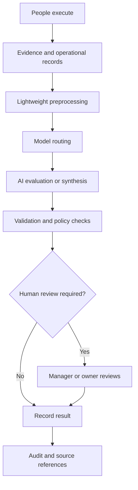

# DOYA OS AI Architecture

## Purpose

This section defines the AI architecture for DOYA OS v1.0.

It explains how AI supports restaurant operations without becoming the final operational authority. It is documentation only. It does not define application code, SQL migrations, model provider configuration, or prompt implementation.

## Problem

AI can create operational value only when it is grounded in real restaurant workflows, scoped by permissions, supported by evidence, and reviewed by responsible humans.

Without a clear AI architecture:

- Vision inspection may produce unfair pass or fail outcomes.
- AI Manager reports may become generic summaries without evidence.
- Inventory and bonus intelligence may become untraceable predictions.
- Prompt behavior may drift from documented product rules.
- AI cost may grow before the system proves operational value.

## Solution

DOYA OS v1.0 uses bounded AI modules:

| Document | Responsibility |
| --- | --- |
| [AI Principles](./01_AI_Principles.md) | Defines global AI rules and guardrails. |
| [Vision Pipeline](./02_Vision_Pipeline.md) | Defines evidence intake, preprocessing, model routing, and review output flow. |
| [AI Closing Evaluator](./03_AI_Closing_Evaluator.md) | Defines PASS, FAIL, and HUMAN_REVIEW inspection behavior. |
| [AI Manager](./04_AI_Manager.md) | Defines daily report, alert, recommendation, and evidence behavior. |
| [Inventory Intelligence](./05_Inventory_Intelligence.md) | Defines AI-assisted inventory risk explanation. |
| [Bonus Intelligence](./06_Bonus_Intelligence.md) | Defines AI-assisted bonus blocker explanation without payroll behavior. |
| [Prompt Design](./07_Prompt_Design.md) | Defines prompt architecture rules without implementing prompts. |
| [Human Review](./08_Human_Review.md) | Defines human approval, rejection, correction, and override rules. |
| [Fraud Detection](./09_Fraud_Detection.md) | Defines anomaly and evidence-integrity checks. |
| [Model Routing and Cost Control](./10_Model_Routing_And_Cost_Control.md) | Defines model selection and cost discipline. |
| [Evaluation and Testing](./11_Evaluation_And_Testing.md) | Defines AI quality gates and regression strategy. |
| [Open Questions](./12_Open_Questions.md) | Records unresolved AI architecture decisions. |

## User

This documentation is for AI engineers, backend engineers, product managers, designers, security reviewers, operators, and AI coding agents.

## Flow

The AI layer supports the existing product philosophy: people execute, AI inspects, the system records, managers correct, and owners decide.

## Architecture

Global AI rules:

- AI assists; humans make final operational decisions.
- Vision AI supports `PASS`, `FAIL`, and `HUMAN_REVIEW`.
- No irreversible decision relies on one model response.
- Lightweight preprocessing runs before expensive multimodal or LLM calls.
- Every AI decision must be explainable and auditable.
- Every AI output must include source references, model or policy version, prompt version, confidence or uncertainty, and review state.
- AI must respect organization, store, role, business date, and RLS boundaries.

## Future Extension

Future AI documentation may add provider-specific routing, prompt files, evaluation datasets, offline review tools, multi-store AI briefing, and model governance.

Those extensions must preserve human review, auditability, cost control, and tenant isolation.

## Related Documents

- [Documentation Style Guide](../STYLE_GUIDE.md)
- [Vision Bible](../00_Vision/README.md)
- [UX Architecture Bible](../03_UX/README.md)
- [Engine Architecture](../04_Engines/README.md)
- [Database Architecture](../05_Database/README.md)
- [API Architecture](../06_API/README.md)
