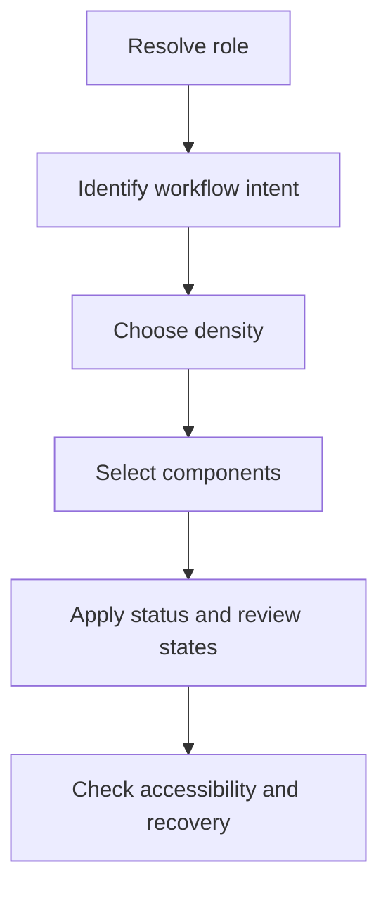

# Design Principles

## Purpose

This document defines the visual and interaction principles for DOYA OS.

It explains how the product should feel and behave across staff execution, manager correction, and owner decision workflows.

## Problem

DOYA OS can fail if it looks like a generic analytics dashboard or admin template.

Staff need execution speed. Managers need review clarity. Owners need decision confidence. The design system must support these different modes without splitting into unrelated products.

## Solution

Use these principles:

1. Design from the operating workflow.
2. Make status visible before detail.
3. Keep staff screens task-first.
4. Keep manager screens evidence-first.
5. Keep owner screens decision-first.
6. Treat AI as reviewable context.
7. Use density only where the role can handle it.
8. Prefer restraint over decoration.
9. Make errors recoverable.
10. Make accessibility part of the component contract.

## User

These principles are for designers, frontend engineers, product managers, AI coding agents, and reviewers.

## Flow

## Architecture

### Role design model

| Role | Interface mode | Design priority |
| --- | --- | --- |
| Owner | Decision surface | Store health, risk, AI report, final action. |
| Manager | Review surface | Queues, evidence, correction, confirmation. |
| Kitchen | Execution surface | Today's tasks, inventory entry, closing photos. |
| Hall | Execution surface | Today's SOP, review target, hall checklist, closing photos. |

### Product tone

The interface should feel:

- Calm.
- Precise.
- Operational.
- Fast.
- Trustworthy.

The interface should not feel:

- Decorative.
- Sales-oriented.
- Overly animated.
- KPI-first.
- Chatbot-first.

## Future Extension

Future principles may add design rules for multi-store owner views, supplier operations, customer feedback workflows, or financial review screens.

New principles should solve a recurring product design conflict rather than describe style preference.

## Related Documents

- [Design System](./README.md)
- [UX Architecture Bible](../03_UX/README.md)
- [Core Principles](../00_Vision/04_Core_Principles.md)
- [AI Principles](../07_AI/01_AI_Principles.md)
