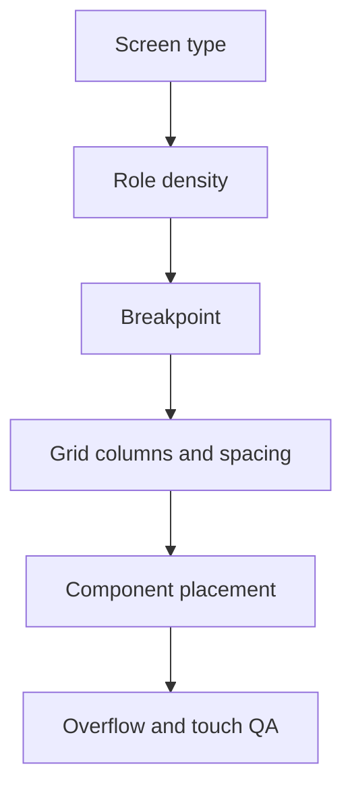

# Grid System

## Purpose

This document defines layout, spacing, and grid behavior for DOYA OS.

It ensures screens feel consistent across mobile staff workflows, manager review views, owner dashboards, and settings.

## Problem

Without a layout system, DOYA OS can become inconsistent: cards drift, tables become cramped, staff tasks require too much scrolling, and dashboards lose scan hierarchy.

The grid must support both high-speed mobile interaction and dense desktop review.

## Solution

Use a 4px base spacing system with role-aware density.

The grid must prioritize:

- Stable alignment.
- Clear content grouping.
- Predictable touch targets.
- Minimal nested containers.
- Responsive layouts that preserve task order.

## User

This document is for product designers, frontend engineers, and AI coding agents.

## Flow

## Architecture

### Spacing scale

| Token | Value | Use |
| --- | --- | --- |
| `space.1` | 4 | Tight internal spacing. |
| `space.2` | 8 | Control gaps, badge padding. |
| `space.3` | 12 | Compact card gaps. |
| `space.4` | 16 | Standard panel padding. |
| `space.5` | 20 | Section spacing. |
| `space.6` | 24 | Page group spacing. |
| `space.8` | 32 | Large section separation. |

### Breakpoints

| Breakpoint | Width | Use |
| --- | --- | --- |
| `mobile` | 360 to 767 | Staff-first execution. |
| `tablet` | 768 to 1023 | Manager review and mixed use. |
| `desktop` | 1024 to 1439 | Standard owner and manager app. |
| `wide` | 1440 and above | Multi-column dashboard and review views. |

### Column model

| Surface | Columns | Notes |
| --- | --- | --- |
| Staff mobile | 1 column | Required action order must remain linear. |
| Manager tablet | 2 columns | Queue plus detail when space allows. |
| Manager desktop | 12 columns | Review queue, evidence, action panel. |
| Owner desktop | 12 columns | Summary cards, risk lists, decision panels. |
| Settings | 12 columns | Navigation rail plus form content. |

### Radius and boundaries

- Standard card radius is 8px.
- Compact controls use 6px.
- Pills and badges may use full radius only when they are status labels.
- Do not place cards inside cards.
- Page sections should be unframed layout bands, not floating card stacks.

## Future Extension

Future grid work may add split-pane behavior, multi-store comparison layouts, responsive table patterns, and localization-aware layout stress tests.

## Related Documents

- [Design Principles](./01_Design_Principles.md)
- [Card System](./06_Card_System.md)
- [Dashboard System](./09_Dashboard_System.md)
- [Mobile First](./10_Mobile_First.md)
