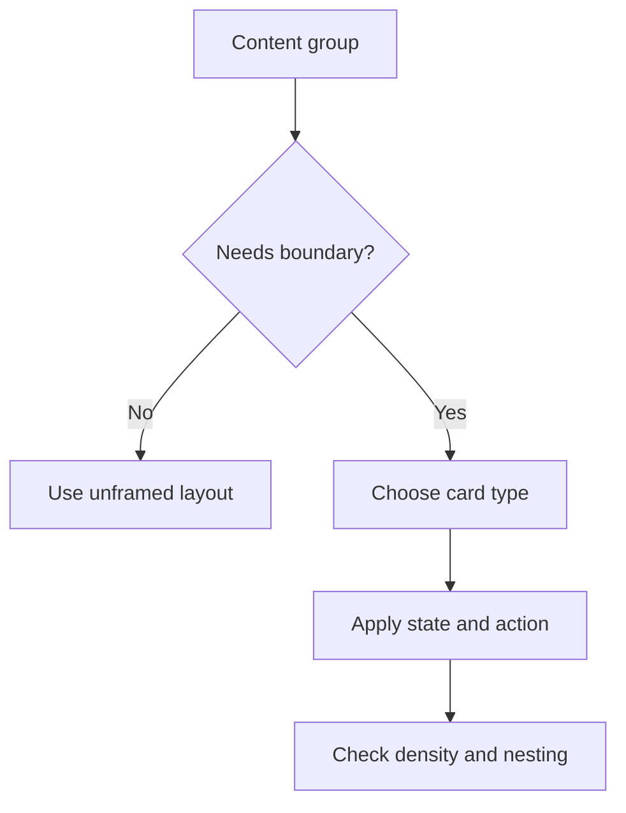

# Card System

## Purpose

This document defines cards and panels in DOYA OS.

Cards group operating information, not decoration. They must support scanning, status, and action.

## Problem

Cards can make SaaS products look organized while hiding hierarchy and wasting space.

DOYA OS needs cards for repeated items, summaries, and review groups, but page sections should not become nested card stacks.

## Solution

Use cards only when the content benefits from a visible boundary.

Cards are allowed for:

- Dashboard summaries.
- Task groups.
- Review queue items.
- Evidence panels.
- Settings groups.
- Empty and error states.

Cards are not allowed as decorative wrappers around every page section.

## User

This document is for designers, frontend engineers, and AI coding agents.

## Flow

## Architecture

### Card components

| Component | Purpose | States | Variants | Spacing | Typography | Interaction | Accessibility | Future extensions |
| --- | --- | --- | --- | --- | --- | --- | --- | --- |
| Summary Card | Shows one owner or manager summary. | Default, warning, critical, loading, empty. | Store health, inventory risk, bonus, AI alert. | 16 padding, 12 internal gap. | Title `text.caption`; value `text.section`; note `text.bodySmall`. | Opens related detail when actionable. | Must expose label and value together. | Trend mini-chart variant. |
| Task Card | Groups staff tasks for a module. | Not started, in progress, submitted, failed, complete. | Kitchen, Hall, Inventory, Closing. | 16 mobile, 20 desktop. | Title `text.cardTitle`; body `text.body`. | Primary action at bottom. | Minimum 44px action target. | Offline queue state. |
| Review Card | Shows manager item needing judgment. | New, viewed, overdue, resolved. | AI Closing, Inventory, Bonus, AI Manager. | 12 compact, 16 standard. | Title `text.body`, metadata `text.caption`. | Opens evidence and actions. | Severity visible in text. | Bulk review grouping. |
| Evidence Card | Contains photo or source record. | Loading, available, restricted, failed. | Image, record, comparison. | 12 padding around media. | Caption `text.caption`. | Zoom or open metadata. | Alt text and fallback required. | Annotation layer. |
| Settings Card | Groups related configuration. | Clean, dirty, saving, error, saved. | Staff, store, roles, bonus, inventory. | 20 desktop, 16 mobile. | Header `text.section`; labels `text.caption`. | Save action outside nested card stacks. | Field errors must be associated. | Version history panel. |

### Card rules

- Radius: 8px maximum for standard cards.
- Border: use subtle border before shadow.
- Shadow: reserved for overlays and floating drawers.
- Nesting: do not put cards inside cards.
- Action: a card may be clickable only when the entire card has one clear destination.

## Future Extension

Future card work may add chart cards, multi-store comparison cards, audit cards, and evidence comparison layouts.

## Related Documents

- [Grid System](./04_Grid_System.md)
- [Component Library](./05_Component_Library.md)
- [Dashboard System](./09_Dashboard_System.md)
- [Accessibility](./14_Accessibility.md)
