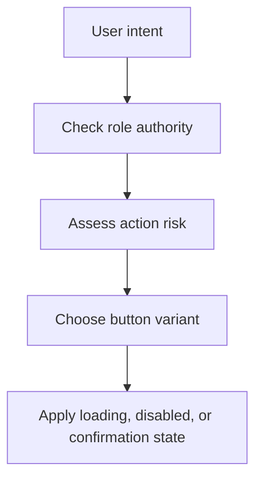

# Button System

## Purpose

This document defines buttons and command controls in DOYA OS.

Buttons express what a user can do, what authority they have, and what state the workflow will enter.

## Problem

Ambiguous actions create operational risk. A manager rejecting a closing photo, an owner overriding bonus state, or a staff member submitting evidence must see a clear action with clear consequence.

Buttons must be consistent across desktop and mobile without becoming visually noisy.

## Solution

Use a small set of button types with strict semantics.

Buttons should be:

- Verb-led.
- Role-aware.
- State-aware.
- Easy to tap.
- Safe for destructive or irreversible actions.

## User

This document is for designers, frontend engineers, QA reviewers, and AI coding agents.

## Flow

## Architecture

### Button components

| Component | Purpose | States | Variants | Spacing | Typography | Interaction | Accessibility | Future extensions |
| --- | --- | --- | --- | --- | --- | --- | --- | --- |
| Primary Button | Executes main safe action. | Default, hover, pressed, focused, loading, disabled. | Standard, full-width mobile. | 12 horizontal, 8 vertical; 44px min height. | `text.control`, medium. | One primary per action group. | Name must describe result. | Split action if future need is proven. |
| Secondary Button | Executes supporting action. | Default, hover, pressed, focused, disabled. | Standard, subtle, outline. | Same as primary. | `text.control`. | Can appear beside primary. | Contrast must meet minimum. | Context menu trigger. |
| Destructive Button | Performs destructive or high-risk action. | Default, hover, pressed, focused, loading, disabled. | Standard, confirmation-required. | Same as primary. | `text.control`, semibold. | Requires confirmation for irreversible actions. | Must include explicit label, not icon only. | Multi-step approval. |
| Icon Button | Performs compact common command. | Default, hover, pressed, focused, disabled, selected. | Toolbar, table row, navigation. | 36px min desktop, 44px mobile. | No visible text unless paired. | Tooltip or label required. | Accessible name required. | Keyboard shortcut hints. |
| Status Action Button | Advances workflow state. | Pass, fail, review, approve, reject, resubmit. | Staff, manager, owner. | 44px min height. | `text.control`, semibold. | Uses semantic color with text label. | Color cannot be only cue. | Batch state actions. |

### Button hierarchy

- Staff screens should show one clear next action.
- Manager review screens may show approve, reject, and assign correction together.
- Owner decision screens may show review, assign, or record decision.
- Destructive or override actions require confirmation and reason.

## Future Extension

Future button work may add command palettes, keyboard shortcut support, and split-button patterns for owner and manager power users.

## Related Documents

- [Form System](./07_Form_System.md)
- [Icons](./12_Icons.md)
- [Accessibility](./14_Accessibility.md)
- [Human Review](../07_AI/08_Human_Review.md)
