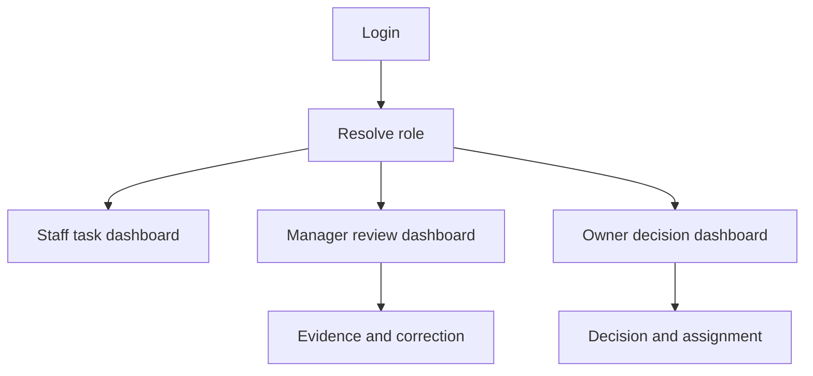

# Dashboard System

## Purpose

This document defines dashboard design for DOYA OS.

Dashboards are role-scoped operating surfaces, not generic KPI pages.

## Problem

Dashboard UI can easily drift into metric display without operational action.

DOYA OS dashboards must answer what needs attention, what is blocked, what AI found, what managers corrected, and what owners need to decide.

## Solution

Use role-specific dashboards:

- Staff dashboards show today's tasks and status.
- Manager dashboards show review queues and correction work.
- Owner dashboards show store health, risk, AI Manager report, inventory risk, and bonus unlock.

## User

This document is for designers, frontend engineers, product managers, and AI coding agents.

## Flow

## Architecture

### Dashboard components

| Component | Purpose | States | Variants | Spacing | Typography | Interaction | Accessibility | Future extensions |
| --- | --- | --- | --- | --- | --- | --- | --- | --- |
| Store Health Summary | Shows owner or manager current operating state. | Healthy, attention, decision required, loading, stale. | Owner, manager. | 16 card padding, 12 internal gap. | Value `text.section`; label `text.caption`. | Opens detail or AI Manager report. | State label required. | Multi-store comparison. |
| Action Queue | Lists required review or correction work. | Empty, populated, overdue, filtered. | Manager, owner. | 8 row gap. | Row title `text.bodySmall`. | Row opens detail drawer. | Queue count announced. | Saved queue filters. |
| Staff Task Panel | Shows today's required staff work. | No tasks, assigned, in progress, failed, complete. | Kitchen, Hall. | 16 mobile padding. | Task title `text.body`; status `text.caption`. | Tap task to act. | 44px touch targets. | Offline status. |
| AI Report Preview | Shows AI Manager summary and status. | Generating, ready, stale, failed. | Owner, manager. | 16 padding. | Summary `text.bodySmall`. | Opens AI Manager. | Generation state text required. | Multi-store briefing. |
| Risk Card | Shows inventory, closing, or bonus risk. | Clear, warning, critical, review required. | Inventory, closing, bonus. | 16 padding. | Label `text.caption`; value `text.cardTitle`. | Opens source module. | Risk must use label and icon. | Trend sparkline. |

### Layout rules

- Owner desktop dashboard uses 12 columns.
- Manager desktop dashboard prioritizes queue plus detail.
- Staff dashboard is one-column mobile-first.
- No screen should expose modules hidden by role.
- Stale data must be visible.

## Future Extension

Future dashboard work may add multi-store comparison, owner saved views, keyboard navigation for queues, and materialized dashboard health views.

## Related Documents

- [UX Dashboard](../03_UX/08_Dashboard.md)
- [Dashboard API](../06_API/05_Dashboard_API.md)
- [Card System](./06_Card_System.md)
- [Grid System](./04_Grid_System.md)
