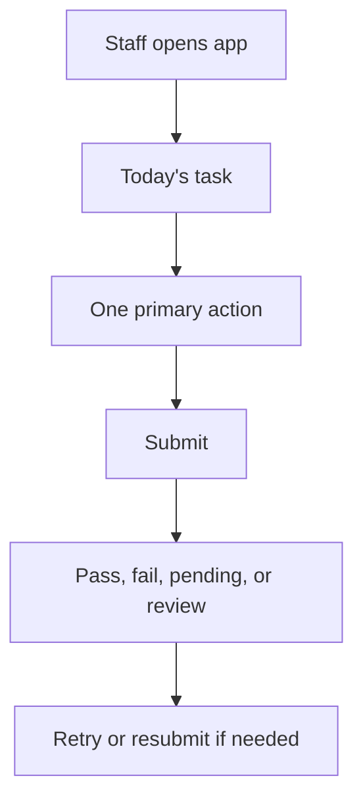

# Mobile First

## Purpose

This document defines mobile-first behavior for DOYA OS.

Mobile-first is required because Kitchen and Hall staff use DOYA OS during active restaurant operations.

## Problem

A desktop-first admin interface slows staff down. During prep, inventory, and closing, staff need obvious actions, large controls, and recoverable submission states.

The mobile system must support speed without hiding manager and owner complexity on larger screens.

## Solution

Design staff workflows mobile-first and manager or owner workflows responsive-first.

Mobile staff screens should show:

- Today's tasks.
- Required action.
- Pass or fail status.
- Resubmit path.
- Store Level progress.
- Personal share percentage when applicable.

They should not show complex analytics, manager notes, or owner-level decisions.

## User

This document is for product designers, frontend engineers, QA reviewers, and AI coding agents.

## Flow

## Architecture

### Mobile components

| Component | Purpose | States | Variants | Spacing | Typography | Interaction | Accessibility | Future extensions |
| --- | --- | --- | --- | --- | --- | --- | --- | --- |
| Mobile Header | Shows current role, store, and business date. | Default, offline, sync pending. | Staff, manager. | 12 padding. | `text.bodySmall`, semibold. | Store switch only if allowed. | Header must not hide page title. | Multi-store switch. |
| Bottom Action Bar | Keeps main action reachable. | Default, loading, disabled, error. | Submit, resubmit, complete, save. | 16 padding, safe-area aware. | `text.control`. | Sticky to bottom when task is active. | Focus order must remain logical. | Offline queue action. |
| Task Stepper | Shows staff task progress. | Not started, active, complete, failed. | Kitchen, Hall. | 12 gap between steps. | `text.bodySmall`. | Step opens only when available. | Current step announced. | Multi-step SOP templates. |
| Camera Capture | Captures closing evidence. | Ready, permission denied, uploading, uploaded, failed. | Kitchen, Hall. | 16 padding; preview full width. | Instructions `text.body`. | Camera first, upload fallback. | Permission error must be clear. | Offline capture queue. |

### Mobile rules

- Minimum touch target is 44px.
- Use one primary action per staff screen.
- Avoid horizontal scrolling.
- Use short labels and visible status.
- Keep destructive actions out of staff flows unless correction requires them.
- Preserve task order from UX flow.

## Future Extension

Future mobile work may add offline mode, native camera integration, barcode scan entry, and push notification patterns.

## Related Documents

- [Kitchen User Flow](../03_UX/06_Kitchen_User_Flow.md)
- [Hall User Flow](../03_UX/07_Hall_User_Flow.md)
- [Form System](./07_Form_System.md)
- [Button System](./08_Button_System.md)
