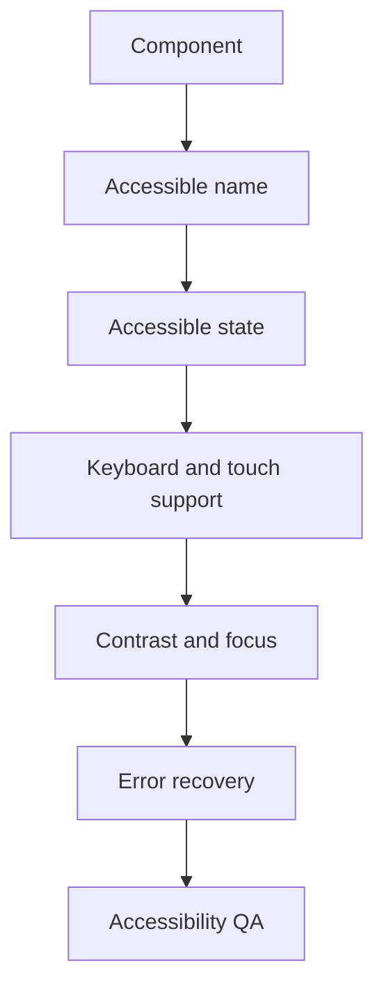

# Accessibility

## Purpose

This document defines accessibility requirements for DOYA OS.

Accessibility is required because DOYA OS supports time-sensitive restaurant operations, not optional browsing.

## Problem

If staff cannot read, tap, navigate, or understand a state, operations fail. If managers cannot distinguish review states or owners cannot understand risk, the product becomes unreliable.

Accessibility must be designed into components before implementation.

## Solution

Use accessibility as a component requirement.

Every interactive component must support:

- Keyboard access.
- Screen-reader name and state.
- Visible focus.
- Sufficient contrast.
- Touch target requirements.
- Error recovery.
- Non-color status cues.

## User

This document is for designers, frontend engineers, QA reviewers, product managers, and AI coding agents.

## Flow

## Architecture

### Accessibility components

| Component | Purpose | States | Variants | Spacing | Typography | Interaction | Accessibility | Future extensions |
| --- | --- | --- | --- | --- | --- | --- | --- | --- |
| Focus Ring | Shows keyboard focus. | Visible, hidden only for pointer interaction, error focus. | Standard, danger. | 2px visual offset equivalent. | Not applicable. | Appears on keyboard navigation. | Must be visible on light and dark surfaces. | High-contrast focus mode. |
| Status Text | Communicates workflow state. | Pass, fail, review, pending, blocked. | Badge, inline, card. | 4 to 8 gap from icon. | `text.caption` or `text.bodySmall`. | Non-interactive unless part of control. | Color plus text plus icon. | Localized state language. |
| Error Message | Explains recoverable issue. | Inline, summary, blocking. | Field, form, page. | 4 to 8 gap from field. | `text.caption` inline; `text.bodySmall` page. | Focus moves to first blocking error. | Programmatically associated with field. | Error summary region. |
| Touch Target | Defines minimum interactive area. | Default, compact, disabled. | Mobile, desktop. | 44px mobile, 36px desktop minimum. | Control typography. | Pointer and keyboard usable. | Disabled state must be announced. | Native app target rules. |
| Live Region | Announces async state. | Loading, success, failure, review required. | Form, upload, AI job, notification. | Not visual by default. | Not visual by default. | Announces state changes. | Must not spam repeated updates. | Queue progress announcements. |

### Requirements

- Minimum normal text contrast target is 4.5:1.
- Large text and icon contrast target is at least 3:1.
- Do not rely on color alone.
- Preserve heading order.
- Use visible labels for critical controls.
- Avoid hidden instructions for staff workflows.
- Respect reduced motion preference.
- Ensure responsive layouts do not reorder focus unexpectedly.

## Future Extension

Future accessibility work may add formal WCAG audit checklists, localization accessibility rules, screen-reader test scripts, and low-vision high-contrast themes.

## Related Documents

- [Color System](./02_Color_System.md)
- [Typography](./03_Typography.md)
- [Button System](./08_Button_System.md)
- [Animation](./11_Animation.md)
