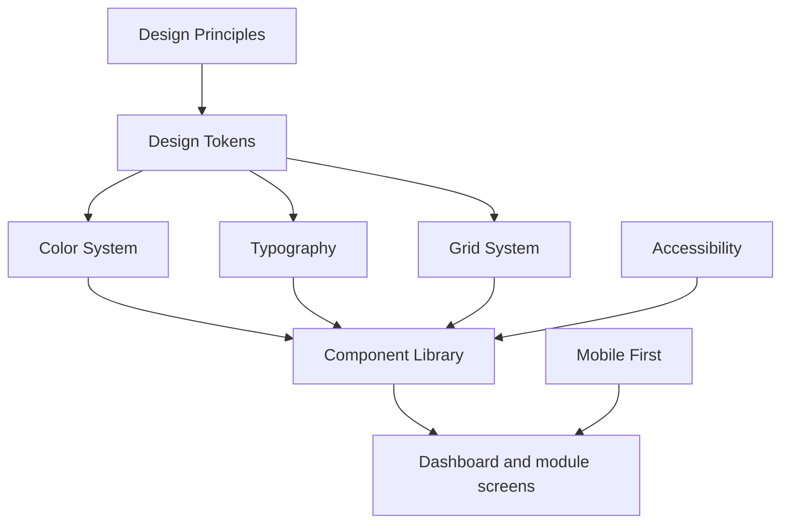

# DOYA OS Design System

## Purpose

This section defines the DOYA OS design system.

It is the source of truth for visual language, layout, components, accessibility, motion, icons, dark mode, and design tokens. It gives designers, frontend engineers, product managers, and AI coding agents a shared design contract before UI implementation begins.

## Problem

DOYA OS is used by different roles in different environments.

Kitchen and Hall staff need fast, clear, mobile-first task execution during real operations. Managers need exception queues, evidence review, and correction flows. Owners need a remote decision surface with trustworthy operational context. A generic SaaS UI would either expose too much complexity to staff or hide too much detail from managers and owners.

## Solution

The design system uses modern SaaS principles inspired by Apple, Stripe, Linear, Notion, and Vercel:

- Calm surfaces.
- Dense but readable operational data.
- Clear status language.
- Fast mobile execution.
- Strong accessibility.
- Minimal visual decoration.
- Components that reflect role authority and workflow state.

The system must feel precise, quiet, and operational. It must not feel like a marketing dashboard, payroll product, POS terminal, or decorative admin template.

## User

This documentation is for:

- Product designers creating screens and Figma libraries.
- Frontend engineers implementing UI primitives.
- Product managers reviewing UX scope.
- AI coding agents generating future UI work.
- QA reviewers checking accessibility and state coverage.
- Future contributors extending DOYA OS.

## Flow

Read this section in order:

1. [Design Principles](./01_Design_Principles.md)
2. [Color System](./02_Color_System.md)
3. [Typography](./03_Typography.md)
4. [Grid System](./04_Grid_System.md)
5. [Component Library](./05_Component_Library.md)
6. [Card System](./06_Card_System.md)
7. [Form System](./07_Form_System.md)
8. [Button System](./08_Button_System.md)
9. [Dashboard System](./09_Dashboard_System.md)
10. [Mobile First](./10_Mobile_First.md)
11. [Animation](./11_Animation.md)
12. [Icons](./12_Icons.md)
13. [Dark Mode](./13_Dark_Mode.md)
14. [Accessibility](./14_Accessibility.md)
15. [Design Tokens](./15_Design_Tokens.md)

## Architecture

The design system maps directly to the product model:

- Staff interfaces use large touch targets, linear task flow, low information density, and clear pass or fail state.
- Manager interfaces use queues, evidence review, forms, status badges, and correction actions.
- Owner interfaces use summary cards, decision queues, risk state, and audit-aware detail views.
- AI surfaces must expose evidence, confidence, review state, and human decision actions.
- Settings and admin surfaces must prioritize validation, audit, and permission clarity.

## Future Extension

Future design system work may add Figma library structure, frontend component implementation, localization patterns, high-density multi-store views, print and export layouts, and design QA checklists.

Those extensions must preserve staff simplicity, manager correction flow, owner decision clarity, and accessibility.

## Related Documents

- [Documentation Style Guide](../STYLE_GUIDE.md)
- [Vision Bible](../00_Vision/README.md)
- [UX Architecture Bible](../03_UX/README.md)
- [API Architecture](../06_API/README.md)
- [AI Architecture](../07_AI/README.md)
