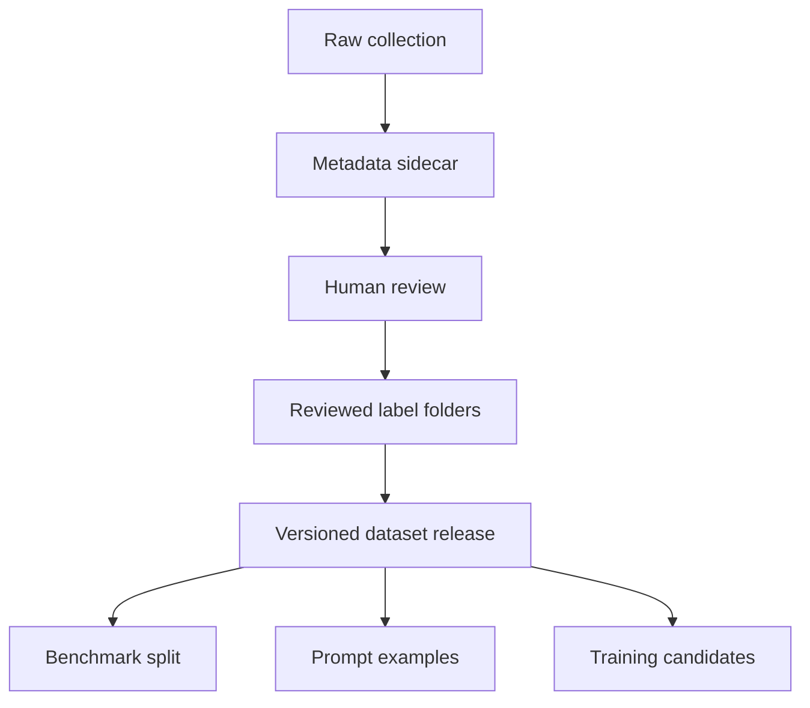

# Directory Structure

## Purpose

This document defines the logical directory structure for DOYA restaurant datasets.

It gives future storage, ingestion, review, and benchmark systems a stable organization model for 100,000+ images across multiple brands and stores.

## Problem

Large image datasets become unreliable when files are organized only by upload time or human memory.

DOYA OS needs structure that supports tenant isolation, brand separation, store scope, dataset versioning, labels, review state, privacy state, benchmark splits, prompt examples, and training candidates.

## Solution

Use a predictable hierarchy that separates raw collection, reviewed labels, dataset releases, benchmark sets, prompt datasets, and training candidates.

Recommended logical structure:

```text
datasets/
  restaurant_images/
    organizations/
      {organization_id}/
        brands/
          {brand_id}/
            stores/
              {store_id}/
                raw/
                  {yyyy}/
                    {mm}/
                      {dd}/
                reviewed/
                  pass/
                  fail/
                  human_review/
                rejected/
                metadata/
    releases/
      v{major}.{minor}.{patch}/
        manifest.json
        train/
        validation/
        benchmark/
        hard_examples/
        prompt_examples/
    benchmarks/
      ai_closing/
        {benchmark_id}/
    prompts/
      ai_closing/
        {prompt_version}/
    training_candidates/
      ai_closing/
        {dataset_version}/
```

## User

This document is for data engineers, AI engineers, platform engineers, privacy reviewers, and AI coding agents.

Restaurant managers may interact with review tools built on top of this structure, but they should not manage the storage hierarchy directly.

## Flow



## Architecture

### Directory responsibilities

| Directory | Responsibility |
| --- | --- |
| `raw/` | Original collected images before label approval. |
| `reviewed/` | Human-verified examples grouped by final label. |
| `rejected/` | Images excluded for privacy, quality, duplication, or scope mismatch. |
| `metadata/` | JSON metadata records and manifests. |
| `releases/` | Immutable dataset versions used for benchmarks or training candidates. |
| `benchmarks/` | Stable evaluation subsets. |
| `prompts/` | Examples used to design, test, or compare prompts. |
| `training_candidates/` | Reviewed data eligible for future model training workflows. |

### Image naming convention

Use deterministic names:

```text
{org}_{brand}_{store}_{zone}_{label}_{yyyymmdd}_{angle}_{device}_{sequence}.{ext}
```

Example:

```text
org_doya_brand_jjambbong_hcm01_kitchen_floor_fail_20260629_wide_iphone14_001.jpg
```

Rules:

- Use lowercase snake_case.
- Use stable IDs, not display names with spaces.
- Do not include staff names or private data.
- Use `pass`, `fail`, or `review` for labels.
- Keep original extension when possible.
- Store image hash in metadata.

## Future Extension

Future implementation may replace filesystem paths with object storage keys while preserving the same logical hierarchy.

The path model should remain compatible with database metadata and dataset manifests.

## Related Documents

- [Metadata Schema](./05_Metadata_Schema.md)
- [Dataset Versioning](./11_Dataset_Versioning.md)
- [Privacy and Retention](./12_Privacy_And_Retention.md)
