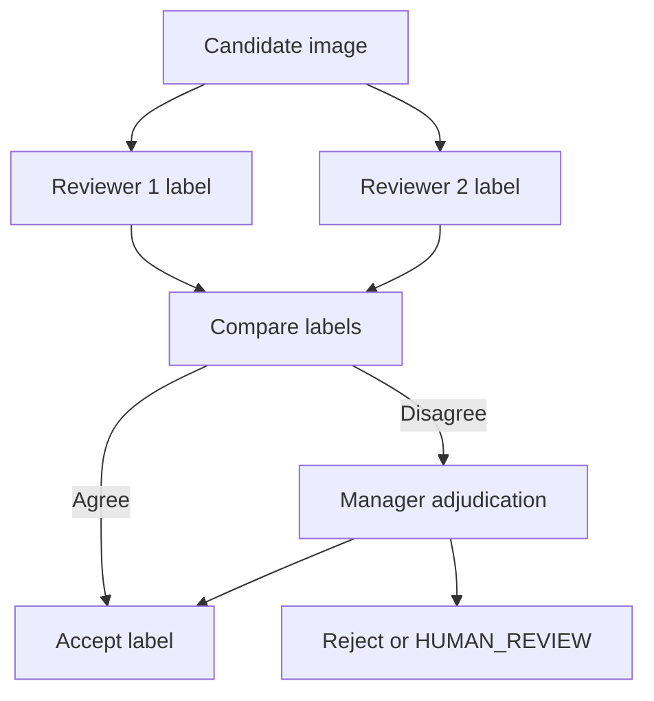

# Labeling Guidelines

## Purpose

This document defines how humans label DOYA restaurant image datasets.

Labels determine whether examples can be used for evaluation, benchmarking, prompt design, or future training candidates.

## Problem

Model quality cannot exceed label quality.

If reviewers disagree silently, if labels mix cleanliness with photo quality, or if ambiguous cases are forced into pass or fail, evaluation metrics become unreliable. The system may then overestimate AI readiness and under-detect critical false passes.

## Solution

Use explicit labels, reviewer roles, disagreement handling, and issue categories.

Primary labels:

| Label | Meaning |
| --- | --- |
| `PASS` | Required zone is visible and acceptable for closing. |
| `FAIL` | Required zone is visible and contains a clear correctable issue. |
| `HUMAN_REVIEW` | Evidence is unclear, incomplete, low-quality, or operationally ambiguous. |
| `REJECTED` | Image should not enter the dataset because of privacy, duplication, corruption, or scope mismatch. |

## User

This document is for human labelers, managers, AI engineers, QA reviewers, and data governance owners.

## Flow

## Architecture

### Labeling rules

Use `PASS` when:

- The required zone is visible.
- The condition is acceptable for closing.
- No corrective action is visible.

Use `FAIL` when:

- The required zone is visible.
- A correctable issue is visible.
- The issue affects cleanliness, food safety, reset quality, opening readiness, or SOP compliance.

Use `HUMAN_REVIEW` when:

- The evidence is too dark, blurry, cropped, obstructed, reflective, or incomplete.
- The issue may exist but cannot be confirmed.
- Reviewers disagree and adjudication cannot resolve the label.

Use `REJECTED` when:

- The image contains private information.
- The image is duplicated.
- The image is corrupt.
- The image is outside the assigned zone.
- The image cannot be legally retained.

### Issue taxonomy

| Issue category | Examples |
| --- | --- |
| `debris` | Food pieces, packaging, dirt, floor debris. |
| `grease` | Stove edge grease, backsplash residue, oily film. |
| `spill` | Refrigerator spill, wet counter, standing liquid. |
| `clutter` | Counter clutter, unreset POS area, tools left out. |
| `misalignment` | Chairs not reset, tables out of place. |
| `visibility` | Dark, blurry, cropped, reflective, obstructed. |
| `privacy` | Face, receipt, payment screen, customer data. |

### Reviewer requirements

- Every benchmark example must have at least two labels.
- Disagreements must be recorded.
- Adjudication must identify the final label owner.
- Label notes should be written in the local operating language and English when practical.
- The final label must distinguish operational failure from evidence quality failure.

## Future Extension

Future tooling may support bounding boxes, segmentation masks, severity scores, reviewer confidence, and multilingual label translation workflows.

## Related Documents

- [Quality Control](./06_Quality_Control.md)
- [Hard Examples](./07_Hard_Examples.md)
- [Metadata Schema](./05_Metadata_Schema.md)
