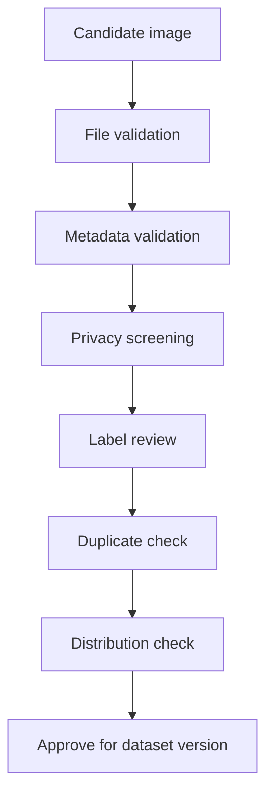

# Quality Control

## Purpose

This document defines quality control for DOYA restaurant datasets.

Quality control determines whether collected images and labels are eligible for evaluation, benchmark, prompt, or training candidate datasets.

## Problem

Large datasets accumulate errors quickly.

At 100,000+ images, even a small percentage of duplicate files, mislabeled examples, privacy leaks, blurry images, or brand-scope mistakes can make benchmarks unreliable and model behavior unsafe.

## Solution

Use layered quality control before examples enter versioned datasets.

Quality gates:

1. File validation.
2. Metadata validation.
3. Privacy screening.
4. Label consistency review.
5. Duplicate detection.
6. Distribution checks.
7. Benchmark leakage checks.
8. Release approval.

## User

This document is for QA engineers, data engineers, AI engineers, privacy reviewers, and dataset release owners.

## Flow

## Architecture

### Quality gates

| Gate | Required check | Failure action |
| --- | --- | --- |
| File validation | Supported image type, readable file, size limits, dimensions. | Reject or request recapture. |
| Metadata validation | Required fields present and schema-valid. | Return to metadata queue. |
| Privacy screening | No faces, receipts, payment screens, or private data. | Redact or reject. |
| Label consistency | Two reviewers or adjudication completed. | Route to adjudication. |
| Duplicate detection | Hash and perceptual similarity check. | Keep one representative example. |
| Distribution check | Brand, store, zone, label, angle, lighting balance. | Collect more examples. |
| Leakage check | Benchmark examples not reused in training candidates. | Remove from split. |
| Release approval | Dataset owner signs off. | Block release. |

### Distribution metrics

Track:

- Images by organization, brand, and store.
- Images by zone.
- Images by label.
- Images by angle.
- Images by lighting condition.
- Images by language.
- Images by device type.
- Hard examples by issue type.
- Rejected images by reason.

### Human verification workflow

Every benchmark and training candidate example requires:

- Reviewer 1 label.
- Reviewer 2 label.
- Agreement status.
- Adjudicator decision when labels differ.
- Final label.
- Review timestamp.

Human review should distinguish photo quality problems from actual operating failures.

## Future Extension

Future implementation may include automated blur checks, brightness checks, perceptual hashing, OCR privacy detection, face detection, active learning queues, and reviewer calibration reports.

## Related Documents

- [Labeling Guidelines](./04_Labeling_Guidelines.md)
- [Metadata Schema](./05_Metadata_Schema.md)
- [Privacy and Retention](./12_Privacy_And_Retention.md)
