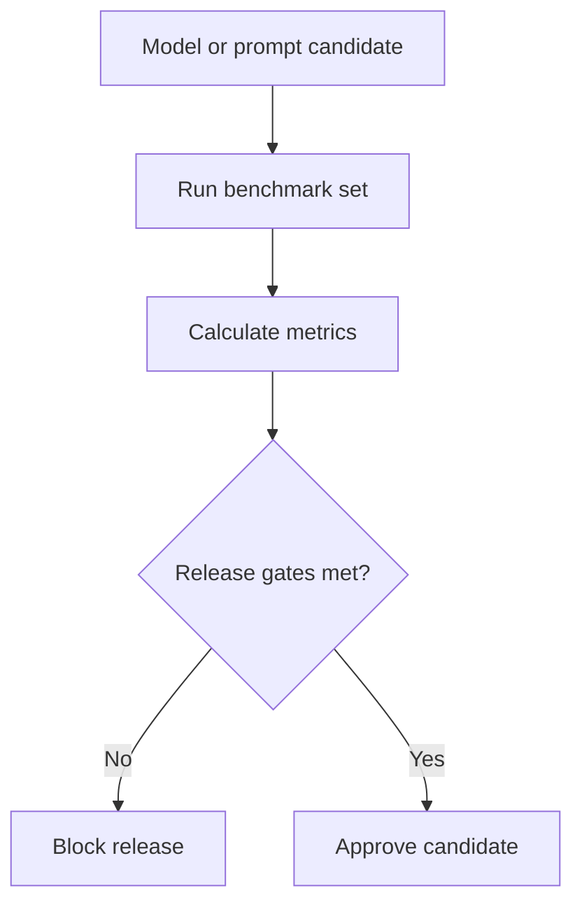

# Model Benchmark

## Purpose

This document defines benchmark methodology for DOYA restaurant AI models.

Benchmarks determine whether a prompt, model, calibration rule, or routing change is safe enough for restaurant operations.

## Problem

AI improvements can regress safety.

A new model may improve average accuracy while increasing critical false passes. A prompt may reduce human review rate while accepting ambiguous evidence. Without stable benchmarks, DOYA OS cannot compare versions reliably.

## Solution

Use versioned benchmark sets with fixed examples, stable metrics, and release gates.

Benchmark sets must include:

- Clean pass examples.
- Dirty fail examples.
- Human review examples.
- Hard examples.
- Multiple brands and stores.
- Multiple languages in metadata.
- Multiple lighting and angle conditions.

## User

This document is for AI engineers, QA engineers, product managers, dataset owners, and release approvers.

## Flow

## Architecture

### Required metrics

| Metric | Definition | Release expectation |
| --- | --- | --- |
| Critical false pass rate | Expected `FAIL`, model returns final `PASS`. | Must be `0%`. |
| False fail rate | Expected `PASS`, model returns final `FAIL`. | Should be under `10%`. |
| Human review rate | Final decision is `HUMAN_REVIEW`. | Should be under `25%` after calibration. |
| Pass precision | Returned pass examples that are truly pass. | Must remain high for release. |
| Fail recall | Failing examples detected as fail or review. | Must prioritize safety. |
| Invalid output rate | Schema-invalid model responses. | Must be near zero. |
| Latency | Time per evaluation. | Must fit staff workflow. |
| Cost | Cost per accepted evaluation. | Must fit operating budget. |

### Benchmark split rules

- Benchmark examples must be immutable within a version.
- Benchmark examples must not be used as prompt examples.
- Benchmark examples must not be training candidates for the model being evaluated.
- Critical false pass examples remain in regression suites.
- Hard examples are reported separately and together with the full benchmark.

### Acceptance gate

Minimum production gate:

- Critical false pass rate: `0%`.
- False fail rate: under `10%`.
- Human review rate: under `25%` after calibration.
- Invalid structured output rate: under `1%`.
- All benchmark runs tied to dataset version, prompt version, and model version.

## Future Extension

Future benchmarks may compare multiple models, route by cost, test store-specific thresholds, and include video frame sampling benchmarks.

## Related Documents

- [Hard Examples](./07_Hard_Examples.md)
- [Dataset Versioning](./11_Dataset_Versioning.md)
- [AI Evaluation Lab](../07_AI/13_AI_Evaluation_Lab.md)
