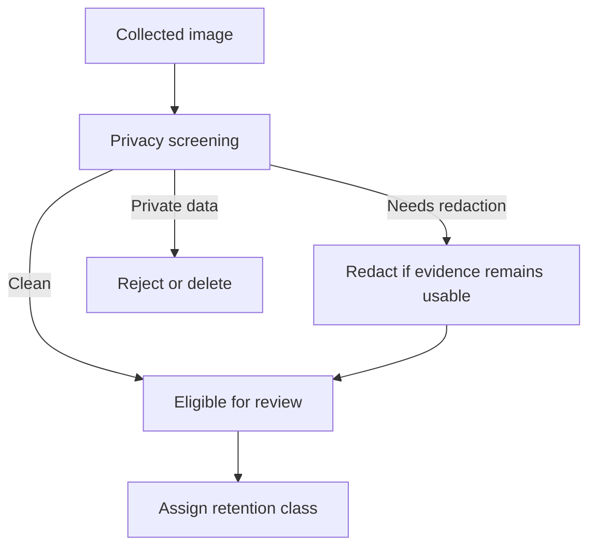

# Privacy and Retention

## Purpose

This document defines privacy and retention rules for DOYA restaurant datasets.

It explains what image data may be retained, what must be rejected or redacted, and how retention class affects evaluation, benchmark, prompt, and training candidate use.

## Problem

Restaurant images can unintentionally capture people, payment screens, receipts, customer information, staff identifiers, or private operating details.

If the dataset platform stores these images without rules, it creates privacy risk and weakens trust with restaurants and staff.

## Solution

Classify every image before it enters reviewed datasets.

Privacy rules:

- Reject images with customer faces unless explicit policy allows retention.
- Reject images with payment screens, receipts, phone numbers, or customer data.
- Reject images collected outside the documented workflow.
- Redact only when redaction preserves the operational evidence.
- Store retention class in metadata.
- Delete images when retention policy requires it.
- Do not use privacy-restricted images for prompt examples, benchmarks, or training candidates.

## User

This document is for privacy reviewers, dataset owners, restaurant operators, AI engineers, and platform engineers.

## Flow

## Architecture

### Retention classes

| Class | Meaning | Allowed use |
| --- | --- | --- |
| `short_term` | Temporary operational review only. | Human review, then delete or archive according to policy. |
| `evaluation` | Approved for evaluation lab and calibration. | Evaluation and prompt analysis if benchmark separation is preserved. |
| `benchmark` | Approved for frozen benchmark sets. | Benchmark only; not training for evaluated model. |
| `delete` | Must not be retained. | No use after deletion decision. |

### Privacy exclusion examples

Reject or delete images containing:

- Customer faces.
- Staff face close-ups not required for the workflow.
- Payment terminals showing transaction data.
- Receipts or order tickets with customer information.
- Phone numbers, addresses, or private notes.
- Screens from third-party delivery, accounting, or payroll systems.

### Retention principles

- Retain the minimum data needed for evaluation.
- Prefer metadata references over copying images.
- Keep deletion decisions auditable.
- Keep privacy state separate from model quality labels.
- Review retention rules before multi-brand rollout.

## Future Extension

Future implementation may include automated face detection, OCR privacy checks, redaction workflows, consent tracking, and data deletion jobs.

## Related Documents

- [Metadata Schema](./05_Metadata_Schema.md)
- [Data Governance](./13_Data_Governance.md)
- [Image Collection Protocol](./03_Image_Collection_Protocol.md)
