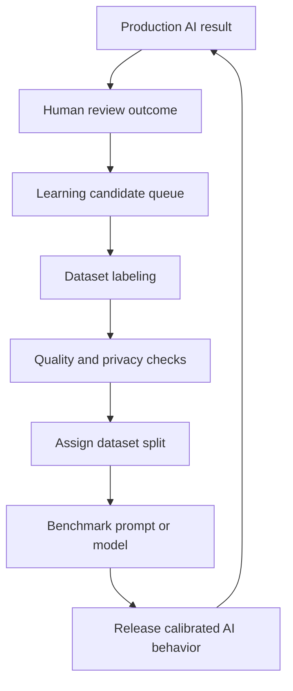

# Continuous Learning

## Purpose

This document defines the continuous AI improvement loop for DOYA OS datasets.

Continuous learning describes how production review outcomes become candidate examples for better evaluation, prompts, calibration, and future training data.

## Problem

Restaurant operations change over time.

New stores open, lighting changes, equipment changes, staff behavior changes, and AI models drift. If DOYA OS does not learn from human review outcomes, the evaluator becomes stale. If it learns automatically without governance, it can reinforce incorrect labels or privacy mistakes.

## Solution

Use a governed continuous learning loop.

Production examples should move through review before influencing AI behavior:

1. AI evaluates evidence.
2. Human review confirms, rejects, or corrects result.
3. Disagreement cases enter candidate queue.
4. Dataset reviewers label and verify candidates.
5. Quality control and privacy checks run.
6. Examples enter hard-example, benchmark, prompt, or training candidate sets.
7. Benchmarks decide whether AI changes are ready.

## User

This document is for AI engineers, dataset owners, QA engineers, product managers, and restaurant operations leaders.

## Flow

## Architecture

### Candidate sources

| Source | Why it matters |
| --- | --- |
| Critical false pass | Highest priority regression example. |
| False fail | Reduces unnecessary staff re-cleaning. |
| Human review accepted | Helps distinguish ambiguity from acceptable evidence. |
| Human review rejected | Adds realistic failure examples. |
| Repeated low confidence | Indicates prompt, threshold, or collection issue. |
| New store layout | Improves multi-store generalization. |
| New brand workflow | Supports brand-specific operating standards. |

### Learning controls

- No production image should affect model behavior before review.
- Human correction does not automatically become ground truth until verified.
- Benchmark examples must remain protected from training leakage.
- Prompt changes must run benchmarks before release.
- Dataset versions must record which examples came from production review.

## Future Extension

Future systems may include active learning queues, reviewer workload dashboards, drift detection, and automated suggestions for fixture expansion.

Continuous learning must remain governed by human review and dataset versioning.

## Related Documents

- [Hard Examples](./07_Hard_Examples.md)
- [Quality Control](./06_Quality_Control.md)
- [Model Benchmark](./10_Model_Benchmark.md)
- [Data Governance](./13_Data_Governance.md)
