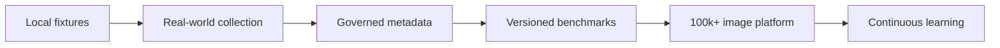

# Dataset Platform Roadmap

## Purpose

This document defines the roadmap for the DOYA Restaurant Dataset Platform.

It sequences dataset work from local evaluation fixtures to governed multi-brand datasets at 100,000+ image scale.

## Problem

Dataset infrastructure can become too heavy too early or too informal too late.

DOYA OS needs enough structure to protect AI quality and privacy now, while leaving implementation choices open until storage, review tools, and production workflows are ready.

## Solution

Build the dataset platform in phases.

## User

This roadmap is for product leaders, AI engineers, data engineers, platform engineers, privacy reviewers, and future contributors.

## Flow

## Architecture

### Phase 1: Local evaluation foundation

Goals:

- Maintain `/dev/ai-eval`.
- Define fixture metadata.
- Define calibration rules.
- Document real-world collection.
- Keep all data local and developer-only.

Exit criteria:

- AI Evaluation Lab works.
- Real-world testing guide exists.
- Critical false pass concept is enforced.

### Phase 2: Real-world fixture set

Goals:

- Collect real AI Closing photos.
- Label examples with two reviewers.
- Add clean, dirty, ambiguous, and hard examples.
- Start brand and store metadata.

Exit criteria:

- At least 720 labeled real-world images for first release evaluation.
- Every AI Closing zone represented.
- Lighting and angle distribution reviewed.

### Phase 3: Governed dataset metadata

Goals:

- Implement metadata records.
- Track privacy and retention status.
- Track label review state.
- Track organization, brand, and store scope.

Exit criteria:

- Metadata schema enforced.
- Privacy review required before benchmark use.
- Dataset owner approves reviewed examples.

### Phase 4: Versioned benchmark platform

Goals:

- Create frozen benchmark versions.
- Separate benchmark, prompt, hard-example, and training candidate splits.
- Record prompt and model benchmark results.

Exit criteria:

- Benchmark release gates are measurable.
- Critical false pass rate is `0%` on release set.
- False fail rate is under `10%`.
- Human review rate is under `25%` after calibration.

### Phase 5: 100,000+ image scale

Goals:

- Support multiple brands and stores.
- Support multilingual metadata.
- Add distribution dashboards.
- Add duplicate detection and quality automation.
- Add governed training candidate manifests.

Exit criteria:

- Dataset versions can include 100,000+ images.
- Brand and store access rules are defined.
- Benchmark and training leakage checks are documented.

### Phase 6: Continuous learning

Goals:

- Feed human review outcomes into candidate queues.
- Add active learning prioritization.
- Track drift and recurring model failures.
- Expand dataset coverage by store layout and brand.

Exit criteria:

- Production review outcomes create governed learning candidates.
- Model or prompt changes are benchmarked before release.
- Dataset lineage is auditable.

## Future Extension

Future roadmap work may add video datasets, OCR datasets, inventory image datasets, supplier evidence datasets, and operational text datasets.

The roadmap should be updated when the dataset platform moves from documentation to implemented storage and review tooling.

## Related Documents

- [Dataset Platform](./README.md)
- [Continuous Learning](./14_Continuous_Learning.md)
- [Model Benchmark](./10_Model_Benchmark.md)
- [Data Governance](./13_Data_Governance.md)
