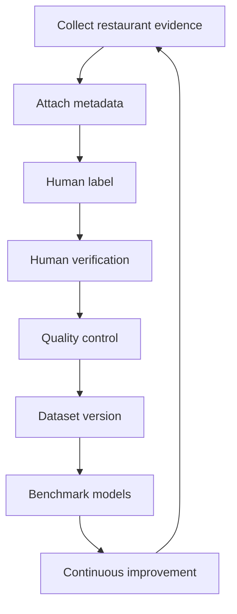

# DOYA Restaurant Dataset Platform

## Purpose

This section defines the dataset management architecture for DOYA OS.

The DOYA Restaurant Dataset Platform governs how restaurant images, labels, metadata, prompt examples, hard examples, benchmark sets, and training candidates are collected, reviewed, versioned, retained, and used to improve AI systems.

## Problem

AI Closing and future restaurant AI features cannot be trusted without representative, governed data.

Small local fixtures are useful for early development, but they do not scale to 100,000+ images across multiple brands, stores, devices, languages, layouts, and operating conditions. Without a dataset platform, DOYA OS risks duplicated files, inconsistent labels, privacy leaks, benchmark drift, and model changes that cannot be audited.

## Solution

Create a dataset architecture that treats restaurant evidence as a governed product asset.

Read this section in order:

1. [Dataset Philosophy](./01_Dataset_Philosophy.md)
2. [Directory Structure](./02_Directory_Structure.md)
3. [Image Collection Protocol](./03_Image_Collection_Protocol.md)
4. [Labeling Guidelines](./04_Labeling_Guidelines.md)
5. [Metadata Schema](./05_Metadata_Schema.md)
6. [Quality Control](./06_Quality_Control.md)
7. [Hard Examples](./07_Hard_Examples.md)
8. [Prompt Dataset](./08_Prompt_Dataset.md)
9. [Training Data](./09_Training_Data.md)
10. [Model Benchmark](./10_Model_Benchmark.md)
11. [Dataset Versioning](./11_Dataset_Versioning.md)
12. [Privacy and Retention](./12_Privacy_And_Retention.md)
13. [Data Governance](./13_Data_Governance.md)
14. [Continuous Learning](./14_Continuous_Learning.md)
15. [Roadmap](./15_Roadmap.md)

## User

This documentation is for:

- AI engineers building evaluation and calibration datasets.
- Data engineers designing storage and metadata systems.
- Product managers deciding release gates.
- Restaurant operators collecting evidence.
- Privacy reviewers validating retention and consent.
- Future AI coding agents generating dataset tooling.

## Flow

## Architecture

The dataset platform is a conceptual system that will later map to storage, metadata tables, review tools, benchmark runners, prompt datasets, and governance workflows.

It is designed for:

- 100,000+ restaurant images.
- Multiple organizations, brands, and stores.
- Multilingual metadata and label notes.
- Human verification and disagreement resolution.
- Privacy-aware retention.
- Versioned benchmarks and release gates.
- Continuous AI improvement without unreviewed production drift.

## Future Extension

Future implementation may include object storage, database-backed metadata, review queues, dataset dashboards, automated de-identification, benchmark automation, and model registry integration.

Those implementations must preserve the governance and audit rules defined in this section.

## Related Documents

- [AI Architecture](../07_AI/README.md)
- [AI Evaluation Lab](../07_AI/13_AI_Evaluation_Lab.md)
- [Real-World AI Closing Testing Guide](../07_AI/14_Real_World_Testing_Guide.md)
- [Database Architecture](../05_Database/README.md)
- [API Architecture](../06_API/README.md)
