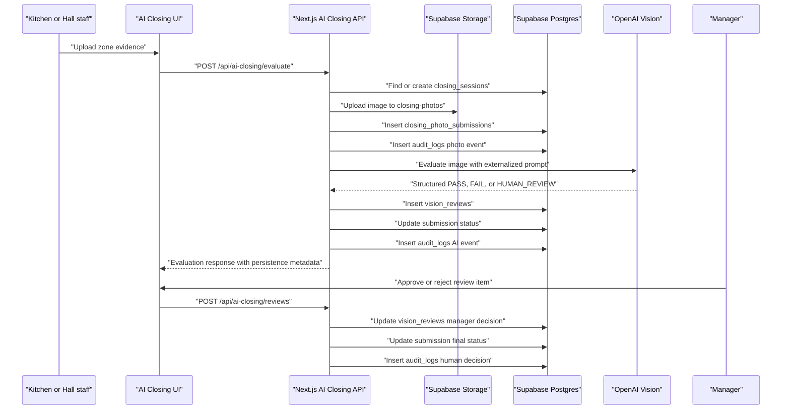
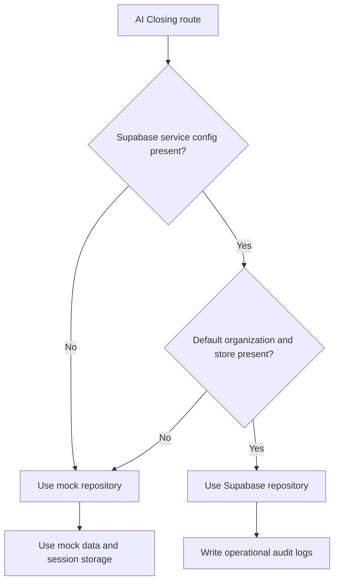

# AI Closing Supabase Flow

## Purpose

This document defines how AI Closing data moves from the frontend into Supabase.

It is the source of truth for the first production-backed AI Closing implementation: closing sessions, photo evidence, Vision AI evaluations, human review decisions, and audit logs.

## Problem

AI Closing cannot rely on browser-only mock state once restaurant operations depend on it.

The system must preserve the full evidence trail:

- Which store and business date the closing evidence belongs to.
- Which kitchen or hall zone was submitted.
- Which image was uploaded.
- Which AI model reviewed the image.
- Which decision was produced.
- Which manager approved or rejected an exception.
- Which audit record proves the event happened.

If this flow is not explicit, later work can accidentally make AI decisions non-auditable, lose photo evidence, or mix closing data across stores.

## Solution

AI Closing uses repository switching.

When Supabase service configuration and default AI Closing context are present, server routes persist data to Supabase. When they are missing, the app uses the existing mock data and session storage fallback.

The active production flow is:

1. Staff selects a closing zone.
2. Staff uploads photo evidence.
3. The server creates or reuses the area closing session.
4. The server uploads the image to the private `closing-photos` bucket.
5. The server creates a `closing_photo_submissions` row.
6. The server writes a photo submission audit log.
7. The server calls the OpenAI Vision evaluator.
8. The server writes a `vision_reviews` row.
9. The server updates the submission status to `pass`, `fail`, or `human_review`.
10. The server writes an AI evaluation audit log.
11. Managers approve or reject human review items.
12. The server persists the manager decision and writes a human review audit log.

## User

This document is for:

- Frontend engineers wiring AI Closing screens.
- Backend engineers maintaining trusted server routes.
- Supabase operators configuring storage, RLS, and seed data.
- AI engineers reviewing the Vision evaluation audit trail.
- Product managers validating operational accountability.
- AI coding agents extending AI Closing without migrating unrelated modules.

Affected restaurant roles:

- `KITCHEN` submits kitchen closing evidence.
- `HALL` submits hall closing evidence.
- `MANAGER` reviews failed or uncertain evidence.
- `OWNER` later reads the operational result through dashboards and reports.

## Flow



### Repository switching



## Architecture

### Environment context

AI Closing server routes require Supabase service credentials and tenant context before persistence is enabled.

Required for Supabase mode:

```env
NEXT_PUBLIC_SUPABASE_URL=
SUPABASE_SERVICE_ROLE_KEY=
SUPABASE_DEFAULT_ORGANIZATION_ID=
SUPABASE_DEFAULT_STORE_ID=
```

Optional:

```env
SUPABASE_DEFAULT_STAFF_ID=
SUPABASE_DEFAULT_BUSINESS_DATE=
```

`SUPABASE_DEFAULT_STAFF_ID` is used as the audit actor until authenticated app-shell context is wired through the AI Closing UI.

### Routes

| Route | Method | Responsibility |
| --- | --- | --- |
| `/api/ai-closing/state` | `GET` | Reads Supabase submissions for the current business date and overlays them onto the existing zone map. |
| `/api/ai-closing/evaluate` | `POST` | Uploads evidence, calls Vision AI, persists evaluation, and writes audit logs. |
| `/api/ai-closing/reviews` | `GET` | Reads submissions requiring manager review. |
| `/api/ai-closing/reviews` | `POST` | Persists manager approve or reject decisions and writes audit logs. |

### Tables

| Table | Use |
| --- | --- |
| `closing_sessions` | One kitchen or hall closing session per store and business date. |
| `closing_photo_submissions` | One uploaded evidence record per zone submission or resubmission. |
| `vision_reviews` | AI decision, score, confidence, explanation, detected issues, and manager decision. |
| `audit_logs` | Immutable operational record for submission, AI evaluation, resubmission, approve, and reject events. |

### Storage

Photos are uploaded to the private `closing-photos` bucket.

Path pattern:

```text
stores/{store_id}/closing/{business_date}/{zone_id}/{uuid}-{filename}
```

The database stores:

- `storage_bucket`
- `storage_path`
- `content_type`
- `image_sha256`

The full image is not embedded into AI audit logs. Audit metadata stores the hash and storage path.

### Audit events

| Event | When |
| --- | --- |
| `ai_closing.photo_submitted` | A new zone evidence image is uploaded. |
| `ai_closing.photo_resubmitted` | A failed zone is submitted again. |
| `ai_closing.ai_evaluated` | Vision AI returns a normalized decision and the review is saved. |
| `ai_closing.ai_evaluation_failed` | The AI evaluation fails after evidence persistence. |
| `ai_closing.human_approved` | A manager approves a human review item. |
| `ai_closing.human_rejected` | A manager rejects a human review item and requires re-cleaning. |

## Future Extension

Future work should replace default environment context with authenticated runtime context:

- Resolve organization, store, and staff from Supabase Auth.
- Restrict service-role routes to server-only AI workflows.
- Add signed image preview URLs for manager review.
- Add correction task records after rejection.
- Add integration tests for Storage upload, RLS access, and audit writes.
- Add dashboard reads from persisted AI Closing data after Dashboard migration begins.

These extensions must not remove mock fallback until local development and AI evaluation workflows have a separate fixture mode.

## Related Documents

- [Supabase Setup](./Supabase_Setup.md)
- [AI Closing Model](../05_Database/05_AI_Closing_Model.md)
- [AI Closing API](../06_API/07_AI_Closing_API.md)
- [AI Closing Evaluator](../07_AI/03_AI_Closing_Evaluator.md)
- [AI Closing UX](../03_UX/09_AI_Closing.md)
