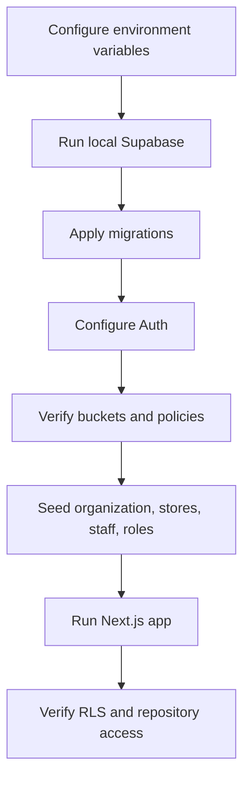

# Supabase Setup

## Purpose

This document defines the Supabase foundation for DOYA OS.

It explains how Supabase Auth, PostgreSQL migrations, Row Level Security, Storage buckets, environment variables, repositories, backups, and deployment should be configured before production use.

## Problem

DOYA OS stores operational truth.

If Supabase is added without a migration plan, role model, RLS policies, storage boundaries, and backup strategy, the product can expose restaurant data across stores, lose auditability, or make future AI workflows difficult to secure.

## Solution

Use Supabase as the production system of record with:

- Supabase Auth for authenticated users.
- `staff` records mapped to `auth.users`.
- Role assignments for `OWNER`, `MANAGER`, `KITCHEN`, and `HALL`.
- PostgreSQL migrations under `supabase/migrations/`.
- RLS enabled on every tenant-owned and operational table.
- Private Storage buckets for operational images and datasets.
- Frontend Supabase clients through `@supabase/ssr` and `@supabase/supabase-js`.
- Repository classes that access Supabase without changing the current UI.

## User

This document is for:

- Supabase implementers.
- Frontend engineers.
- Backend engineers.
- Security reviewers.
- DevOps operators.
- AI coding agents extending the data layer.

## Flow



## Architecture

### Integration plan

Phase 1 creates the foundation:

- Add Supabase dependencies.
- Add Supabase browser, server, and admin clients.
- Add repository classes for Dashboard, AI Closing, and Inventory.
- Add migrations for documented v1 tables.
- Add RLS helper functions and policies.
- Add Storage bucket configuration.
- Add setup documentation.

Phase 2 connects product flows:

- Replace direct mock-data imports with repository calls one module at a time.
- Persist AI Closing sessions, photo submissions, Vision reviews, human review decisions, and audit logs.
- Add authenticated route boundaries.
- Add staff onboarding and role assignment screens.
- Persist inventory entries and dashboard summaries.

Phase 3 hardens production:

- Add service-role-only AI job routes.
- Add audit-log triggers or service-layer audit writers.
- Add backup monitoring.
- Add database observability.
- Add integration tests for RLS policies.

The current commit intentionally keeps existing UI screens visually unchanged and preserves mock data until Supabase data is fully seeded.

### Implemented files

| Path | Purpose |
| --- | --- |
| `supabase/migrations/202606290001_initial_schema.sql` | Creates documented v1 tables, indexes, and update triggers. |
| `supabase/migrations/202606290002_rls_policies.sql` | Adds RLS helper functions and tenant/role policies. |
| `supabase/migrations/202606290003_storage.sql` | Creates private buckets and storage object policies. |
| `supabase/migrations/202606290004_auth_roles.sql` | Seeds permission keys and role provisioning function. |
| `frontend/lib/supabase/` | Supabase client, server, admin, and auth helpers. |
| `frontend/lib/repositories/` | Supabase repository classes for future data integration. |

## Environment Variables

Create `frontend/.env.local` for local development:

```env
NEXT_PUBLIC_SUPABASE_URL=
NEXT_PUBLIC_SUPABASE_PUBLISHABLE_KEY=
SUPABASE_SERVICE_ROLE_KEY=
SUPABASE_DEFAULT_ORGANIZATION_ID=
SUPABASE_DEFAULT_STORE_ID=
SUPABASE_DEFAULT_STAFF_ID=
SUPABASE_DEFAULT_BUSINESS_DATE=
OPENAI_API_KEY=
OPENAI_VISION_MODEL=gpt-5.5
```

Rules:

- `NEXT_PUBLIC_SUPABASE_URL` is safe for browser use.
- `NEXT_PUBLIC_SUPABASE_PUBLISHABLE_KEY` is safe for browser use when RLS is correct.
- `SUPABASE_SERVICE_ROLE_KEY` must never be exposed to browser code.
- Service-role access must be used only in trusted server routes or jobs.
- `SUPABASE_DEFAULT_ORGANIZATION_ID` and `SUPABASE_DEFAULT_STORE_ID` activate AI Closing Supabase mode until authenticated app-shell context is wired.
- `SUPABASE_DEFAULT_STAFF_ID` is optional and is used as the audit actor for AI Closing development flows.
- `SUPABASE_DEFAULT_BUSINESS_DATE` is optional. If omitted, AI Closing uses the current documented mock business date until runtime store context is implemented.
- Production keys must be stored in the deployment provider secret manager.

## Local Development

Recommended local workflow:

1. Install Supabase CLI.
2. Start local Supabase.
3. Apply migrations.
4. Create an organization, brand, store, staff user, and role assignment.
5. Run the frontend.

Commands:

```powershell
supabase start
supabase db reset
cd frontend
npm.cmd run dev
```

After creating an organization, run:

```sql
select public.provision_default_roles('{organization_id}');
```

Then create a `staff` row linked to the authenticated Supabase user and assign the correct role and store.

## Production Deployment

Production deployment should follow this order:

1. Create Supabase project.
2. Configure Auth settings.
3. Apply migrations from `supabase/migrations/`.
4. Confirm Storage buckets exist.
5. Configure production environment variables.
6. Seed initial organization, brand, store, owner staff, and role assignments.
7. Verify RLS with non-owner test accounts.
8. Deploy frontend.
9. Run smoke tests for dashboard, AI Closing, inventory, storage upload, and Auth.

Do not deploy frontend features that depend on Supabase data before tenant, staff, role, and store seed data exists.

AI Closing persistence is enabled only when Supabase service credentials and default organization and store IDs are configured. Without that context, the UI intentionally remains in mock mode.

## Database Migrations

Migrations must be applied in filename order.

Current migration responsibilities:

| Migration | Responsibility |
| --- | --- |
| `202606290001_initial_schema.sql` | Core schema and indexes. |
| `202606290002_rls_policies.sql` | RLS helpers and policies. |
| `202606290003_storage.sql` | Storage buckets and object policies. |
| `202606290004_auth_roles.sql` | Permission keys and role provisioning. |

Migration rules:

- Never edit an applied migration in production.
- Add a new migration for schema changes.
- Keep destructive changes separate and reviewed.
- RLS changes require security review.
- Storage policy changes require upload/download tests.

## Storage Setup

Buckets:

| Bucket | Visibility | Purpose |
| --- | --- | --- |
| `closing-photos` | Private | AI Closing evidence. |
| `inventory` | Private | Inventory photos, receipts, and supporting files. |
| `datasets` | Private | Dataset images, manifests, and metadata. |
| `avatars` | Private | Staff avatars. |

Path conventions:

```text
closing-photos/stores/{store_id}/closing/{business_date}/{category}/{filename}
inventory/stores/{store_id}/{workflow}/{filename}
datasets/organizations/{organization_id}/{dataset_version}/{filename}
avatars/staff/{staff_id}/{filename}
```

Storage policies use path segments to resolve store, organization, or staff scope.

AI Closing uploads use:

```text
closing-photos/stores/{store_id}/closing/{business_date}/{zone_id}/{uuid}-{filename}
```

The uploaded object path is stored in `closing_photo_submissions.storage_path`.

## Auth Setup

DOYA OS uses Supabase Auth for identity and database tables for authorization.

Auth model:

1. User signs in through Supabase Auth.
2. `auth.uid()` maps to `staff.auth_user_id`.
3. Staff record resolves organization.
4. Role and store assignments resolve effective access.
5. RLS enforces row access.

Roles:

| Role | Scope | Intended access |
| --- | --- | --- |
| `OWNER` | Organization | Organization, brands, stores, settings, audit, rules. |
| `MANAGER` | Store | Assigned store operations, reviews, inventory, SOPs. |
| `KITCHEN` | Store | Kitchen SOPs, kitchen closing, inventory entries. |
| `HALL` | Store | Hall SOPs, hall closing, bonus share visibility. |

Provision roles per organization:

```sql
select public.provision_default_roles('{organization_id}');
```

## RLS Setup

RLS is enabled on every tenant-owned and operational table.

Policy helpers:

| Function | Purpose |
| --- | --- |
| `current_staff_id()` | Maps `auth.uid()` to active staff. |
| `has_org_role()` | Checks organization-level role. |
| `has_store_role()` | Checks store-scoped role. |
| `can_access_org()` | Resolves organization read scope. |
| `can_access_store()` | Resolves store read scope. |
| `can_manage_store()` | Resolves manager or owner store authority. |
| `can_submit_closing()` | Resolves kitchen and hall closing submission authority. |

RLS verification checklist:

- Owner can read organization records.
- Manager can read and update assigned store operations.
- Kitchen cannot read manager-only review data outside its submissions.
- Hall cannot read kitchen-only submissions.
- Staff cannot access unassigned stores.
- Anonymous users cannot read tenant tables.
- Service-role writes are audited by trusted server code.

## Backup Strategy

Production backup requirements:

- Enable Supabase automated backups for the project tier.
- Export daily logical backups for critical tables when available.
- Store migration history in Git.
- Store dataset manifests separately from raw image storage.
- Test restore on a non-production project before relying on backups.
- Keep backup access limited to infrastructure owners.

Critical tables:

- `organizations`
- `brands`
- `stores`
- `staff`
- `roles`
- `staff_role_assignments`
- `staff_store_assignments`
- `closing_sessions`
- `closing_photo_submissions`
- `vision_reviews`
- `inventory_*`
- `bonus_*`
- `audit_logs`

Storage backup:

- Treat Storage as operational evidence.
- Retain `closing-photos` according to restaurant policy.
- Retain `datasets` according to dataset version policy.
- Verify that database metadata and storage objects can be restored together.

## Future Extension

Future work should add:

- Supabase seed scripts.
- RLS integration tests.
- Auth onboarding UI.
- Role management UI.
- Audit-log triggers for selected tables.
- Edge Functions or server jobs for AI evaluation persistence.
- Database webhooks for notifications.
- Production monitoring for denied access and storage errors.
- Authenticated AI Closing context that removes the need for default organization and store environment variables.

## Related Documents

- [Database Architecture](../05_Database/README.md)
- [Supabase RLS Policies](../05_Database/12_Supabase_RLS_Policies.md)
- [API Authentication and RBAC](../06_API/02_Authentication_And_RBAC.md)
- [AI Closing Supabase Flow](./AI_Closing_Supabase_Flow.md)
- [Dataset Platform](../09_Dataset/README.md)
