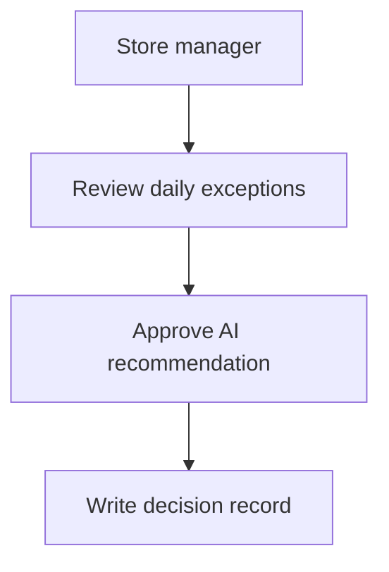

# DOYA OS Documentation Style Guide

## Purpose

This guide defines the official writing standard for DOYA OS documentation.

It applies to every document in the repository. It is written for software engineers, AI coding agents, product managers, operators, designers, and future contributors who need a reliable source of truth for how the platform works and why it exists.

## Documentation Philosophy

### Documentation Comes Before Code

DOYA OS is an AI Restaurant Operating System. It will contain product workflows, operational rules, data models, AI behavior, backend services, frontend interfaces, APIs, prompts, and tests. These systems must be designed before they are implemented.

Documentation comes before code because it:

- Defines the intent of the system before implementation details appear.
- Reduces ambiguity for human contributors and AI coding agents.
- Creates a stable contract between product, operations, design, data, AI, and engineering work.
- Prevents implementation from becoming the only record of product decisions.
- Makes future changes easier to review, test, and extend.

Code describes what the system does now. Documentation describes what the system is supposed to do, why it exists, and how it should evolve.

### Single Source of Truth

Documentation is the single source of truth for DOYA OS.

When documentation and implementation disagree, the disagreement must be resolved explicitly. Contributors should not infer product behavior, AI behavior, data meaning, or operating rules from code alone.

The repository must answer:

- What is the system?
- Who is it for?
- What problem does it solve?
- How should it behave?
- What decisions have already been made?
- What constraints must future contributors preserve?

### Written for Humans and AI Coding Agents

DOYA OS documentation must be readable by people and executable as context by AI coding agents.

A good document should help:

- Engineers implement features without guessing.
- AI agents generate code that matches the intended architecture.
- Product managers evaluate scope and tradeoffs.
- Operators validate whether workflows reflect restaurant reality.
- Reviewers detect missing requirements before code is merged.

Write every document as if it will become prompt context for an AI agent and onboarding material for a new contributor.

## Writing Style

### Influences

DOYA OS documentation should take inspiration from:

- Stripe Engineering: precise, technical, and operationally grounded.
- Linear: concise, structured, and calm.
- Apple Human Interface Guidelines: principle-driven and user-centered.
- Vercel Documentation: direct, practical, and implementation-aware.
- Notion Documentation: clear hierarchy and approachable explanations.

These are references for quality, not brands to imitate.

### Tone

Use a tone that is:

- Technical.
- Concise.
- Production-ready.
- Specific.
- Calm.
- Direct.

Avoid:

- Marketing language.
- Hype.
- Vague claims.
- Decorative phrasing.
- Unverified assumptions.
- Placeholder text.
- Over-explaining obvious concepts.

Prefer:

- "The system stores daily sales by location and business date."
- "Managers review exceptions before an AI-generated action is applied."
- "Inventory recommendations must expose the input data used to produce them."

Avoid:

- "This powerful platform revolutionizes restaurant operations."
- "AI unlocks next-generation productivity."
- "More details coming soon."

## Document Structure

Every markdown document must contain the following sections unless a section is explicitly not applicable. If a section is not applicable, state why in one sentence.

### Purpose

Explain why the document exists.

The Purpose section must answer:

- What decision, system, workflow, or concept does this document define?
- What should readers understand after reading it?
- What future work depends on this document?

### Problem

Define the problem clearly.

The Problem section must answer:

- What ambiguity, user need, operational friction, technical risk, or product gap does this document address?
- What breaks if this problem is not solved?
- What context should contributors understand before proposing a solution?

### Solution

Describe the intended approach.

The Solution section must answer:

- What should DOYA OS do?
- What behavior, structure, policy, or standard should contributors follow?
- What is in scope?
- What is out of scope?

### User

Identify who the document is written for and who the system behavior affects.

Users may include:

- Restaurant owners.
- Store managers.
- Kitchen staff.
- Service staff.
- Operations teams.
- Finance teams.
- Product managers.
- Engineers.
- AI agents.
- Administrators.

Do not use a generic "user" when the role matters.

### Flow

Describe how the concept works over time.

Use this section for:

- User journeys.
- Operational workflows.
- Data lifecycle.
- API request flow.
- AI agent execution flow.
- Review and approval flow.
- Failure and recovery flow.

### Architecture

Explain how the concept connects to the platform.

Include relevant relationships to:

- Frontend.
- Backend.
- Database.
- AI systems.
- APIs.
- Prompts.
- Tests.
- Operations.
- Security.
- Observability.

This section should be conceptual unless implementation details are required.

### Future Extension

Describe how the document may evolve.

Include:

- Known future capabilities.
- Constraints that should remain stable.
- Decisions that require more research.
- Extension points for later implementation.

Do not use this section for vague promises. Future extensions must be plausible and useful.

### Related Documents

Link to related documents using relative paths.

Every document should connect to the rest of the documentation system. If no related document exists yet, write:

```markdown
No related documents yet.
```

Do not invent links to files that do not exist.

## Naming Convention

### Folders

Use numbered folders for major documentation domains when order matters.

Pattern:

```text
docs/00_Vision/
docs/01_Product/
docs/02_Operation/
docs/03_UX/
docs/04_Database/
docs/05_Backend/
docs/06_Frontend/
docs/07_AI/
docs/08_API/
docs/09_Prompts/
docs/10_Test/
docs/decisions/
```

Rules:

- Use two-digit numeric prefixes for ordered domains.
- Use PascalCase after the numeric prefix for major domains.
- Use lowercase for utility folders such as `decisions`.
- Do not rename established folders without an explicit migration decision.
- Do not create duplicate domains with similar names.

### Files

Use numbered markdown files when reading order matters.

Pattern:

```text
01_Mission.md
02_Vision.md
03_Philosophy.md
```

Rules:

- Use two-digit numeric prefixes for ordered documents.
- Use PascalCase or Title_Case words separated by underscores.
- Use `README.md` for folder indexes.
- Use `.md` for all markdown documents.
- Avoid generic filenames such as `notes.md`, `misc.md`, or `draft.md`.

### Headings

Use sentence case or title case consistently within each document.

Rules:

- Use one `#` heading for the document title.
- Use `##` for primary sections.
- Use `###` for subsections.
- Do not skip heading levels.
- Keep headings short and descriptive.
- Do not use headings as slogans.

### Images

Images should clarify structure, flow, or behavior.

Rules:

- Store images under `assets/` or a documented local asset folder when one exists.
- Use descriptive filenames.
- Include meaningful alt text.
- Avoid screenshots when text or diagrams are easier to maintain.
- Do not use decorative images in technical documentation.

Pattern:

```markdown

```

### Diagrams

Prefer diagrams for relationships, lifecycles, and architecture.

Use diagrams when they make a document easier to review or implement. Do not add diagrams for decoration.

Each diagram must have:

- A short introduction.
- A clear label or heading.
- Text explanation after the diagram.

### Mermaid

Use Mermaid for diagrams that can live directly in markdown.

Recommended for:

- Flowcharts.
- Sequence diagrams.
- State diagrams.
- Entity relationships.
- System relationships.

Rules:

- Keep diagrams small enough to review in GitHub.
- Use quoted labels when labels contain punctuation.
- Prefer stable names over implementation-specific names.

Example:



### PlantUML

Use PlantUML only when Mermaid cannot express the diagram clearly.

Recommended for:

- Detailed sequence diagrams.
- Complex component diagrams.
- Formal architecture diagrams.

Rules:

- Keep PlantUML source in markdown code blocks unless a separate diagram source folder is introduced.
- Include a rendered image only when required for review.
- Do not duplicate the same diagram in Mermaid and PlantUML.

## Markdown Rules

### Formatting

Rules:

- Use GitHub Markdown.
- Use short paragraphs.
- Use bullet lists for scannable requirements.
- Use numbered lists for ordered steps.
- Use bold only for emphasis that affects interpretation.
- Use inline code for file paths, commands, identifiers, API fields, and enum values.
- Avoid excessive nesting.
- Avoid raw HTML unless GitHub Markdown cannot express the content.

### Code Blocks

Use fenced code blocks with a language identifier when possible.

Examples:

````markdown
```json
{
  "businessDate": "2026-06-27",
  "locationId": "doya-hcm-001"
}
```
````

Rules:

- Use code blocks for examples, contracts, commands, schemas, and configuration.
- Do not include application code unless the document is explicitly about implementation.
- Keep examples minimal and accurate.
- Do not include fake secrets, credentials, or production tokens.

### Tables

Use tables for comparison, mappings, and structured definitions.

Example:

```markdown
| Field | Meaning | Required |
| --- | --- | --- |
| `businessDate` | Restaurant operating date | Yes |
| `locationId` | Store identifier | Yes |
```

Rules:

- Keep tables narrow.
- Do not use tables for long prose.
- Use consistent column names across related documents.

### Notes

Use notes for supporting context that helps the reader avoid mistakes.

Pattern:

```markdown
> Note: AI-generated recommendations must remain reviewable by a human operator.
```

Rules:

- Keep notes short.
- Do not hide requirements in notes.
- Move critical information into the main document body.

### Warnings

Use warnings for risks, constraints, and irreversible actions.

Pattern:

```markdown
> Warning: Do not allow an AI agent to apply irreversible operational changes without an approval step.
```

Rules:

- Use warnings sparingly.
- Make the consequence clear.
- Include the safer expected behavior.

### Best Practices

Best practices should be actionable.

Prefer:

- "Link each AI workflow to its input data, review owner, and rollback path."

Avoid:

- "Use AI responsibly."

## AI Writing Rules

Every document must answer:

- Why does this exist?
- How does it work?
- Who is responsible for it or affected by it?
- When is it used?

AI agents must follow these rules when generating documentation:

- Never generate placeholder content.
- Always write production-quality documentation.
- Preserve existing terminology unless the document explicitly updates it.
- Do not invent product capabilities that have not been documented.
- Do not create implementation details before the architecture is defined.
- Do not use marketing language.
- Do not write "TBD", "coming soon", or "placeholder".
- If information is missing, document the constraint and the decision required.
- Prefer explicit assumptions over silent guesses.
- Link to existing related documents when they exist.
- Keep each document useful as prompt context for future code generation.

## Repository Structure

Documentation is organized by domain.

Recommended structure:

```text
docs/
    STYLE_GUIDE.md
    00_Vision/
    01_Product/
    02_Operation/
    03_UX/
    04_Database/
    05_Backend/
    06_Frontend/
    07_AI/
    08_API/
    09_Prompts/
    10_Test/
    decisions/
```

Domain responsibilities:

| Folder | Responsibility |
| --- | --- |
| `00_Vision/` | Mission, vision, philosophy, principles, goals, non-goals, roadmap. |
| `01_Product/` | Product requirements, user roles, feature definitions, scope. |
| `02_Operation/` | Restaurant workflows, operating rules, team responsibilities. |
| `03_UX/` | User journeys, interface principles, information architecture. |
| `04_Database/` | Entities, relationships, schema design, data lifecycle. |
| `05_Backend/` | Services, domain logic, jobs, integrations, security behavior. |
| `06_Frontend/` | Client architecture, UI states, page responsibilities. |
| `07_AI/` | AI workflows, agents, evaluation, guardrails, human review. |
| `08_API/` | API contracts, webhooks, request and response shapes. |
| `09_Prompts/` | System prompts, prompt patterns, prompt versioning. |
| `10_Test/` | Test strategy, acceptance criteria, regression cases. |
| `decisions/` | Architecture decision records and major tradeoff records. |

Each folder must include a `README.md` that explains its purpose and links to important documents inside that folder.

## Versioning

Documentation evolves with the product.

Rules:

- Update documentation in the same pull request as related behavior changes.
- Record major product, architecture, data, and AI decisions in `docs/decisions/`.
- Prefer editing the current source of truth over creating competing documents.
- Preserve historical reasoning in decision records.
- Use commit history for line-level history, not duplicated archive files.
- Mark deprecated documents clearly and link to the replacement.

For documents that define contracts, include version notes only when versioning affects consumers.

Example:

```markdown
## Version Notes

Version 1 defines daily sales ingestion for a single restaurant location. Multi-location consolidation will be documented separately.
```

## Pull Request Documentation Rules

Every pull request that changes product behavior, architecture, data, AI behavior, prompts, APIs, tests, or operating workflows must include documentation updates.

Reviewers should reject pull requests when:

- The implementation changes behavior but documentation is unchanged.
- A new concept is introduced without a source-of-truth document.
- AI behavior is changed without updating prompts, guardrails, or evaluation notes.
- API or data contracts change without updating the relevant contract documentation.
- A decision is made in discussion but not recorded in `docs/decisions/`.
- Documentation contains placeholder content.

Pull requests should include:

- Summary of documentation changed.
- Related issue or decision record, when available.
- Impacted product, engineering, AI, or operation domain.
- Any known follow-up documentation work.

## Documentation Checklist

Before merging any documentation change, review the document against this checklist.

### Content

- The document has a clear title.
- The document includes Purpose, Problem, Solution, User, Flow, Architecture, Future Extension, and Related Documents.
- The document explains why the topic matters.
- The document defines who uses or owns the behavior.
- The document describes how the behavior works.
- The document states when the behavior applies.
- The document avoids placeholder content.
- The document avoids marketing language.
- The document uses precise DOYA OS terminology.

### Structure

- The filename follows the naming convention.
- The document lives in the correct folder.
- Headings are ordered and scannable.
- Related documents are linked with valid relative paths.
- Diagrams are included only when they clarify the content.
- Tables are used only when they improve readability.

### Technical Quality

- Examples are accurate and minimal.
- Architecture statements are consistent with existing documentation.
- AI behavior includes ownership, review, and guardrails when applicable.
- API or data examples do not include fake secrets.
- Future extensions are realistic and bounded.

### Review

- A human contributor can understand the document without extra context.
- An AI coding agent can use the document as implementation context.
- The document does not contradict existing source-of-truth documents.
- Any contradiction is resolved or recorded as a decision.
- The pull request explains why the documentation changed.

Documentation is ready to merge only when it improves the repository as a source of truth.
